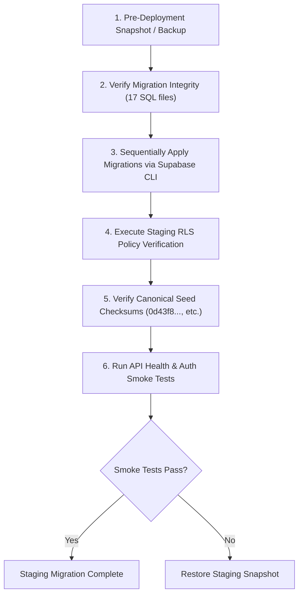
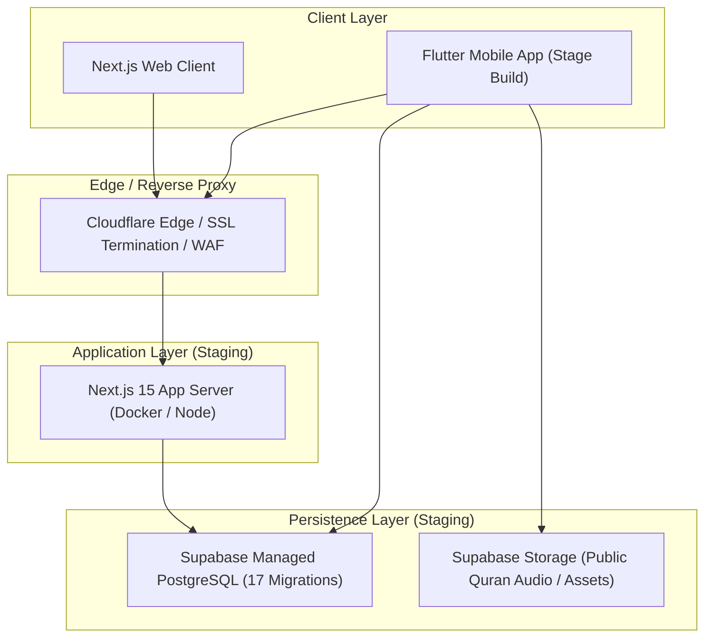

# MILESTONE M10 PHASE 0 — RELEASE RECONNAISSANCE, ENVIRONMENT GAP CLOSURE & STAGING ROADMAP

**Project:** ISLAM UL HARAMAIN / إسلام الحرمين  
**Repository:** `D:\ISLAMIC-PLATFORM`  
**Milestone:** M10 (Mobile Release Packaging, Staging Validation & Production Go-Live Readiness)  
**Phase:** 0 — Release Reconnaissance, Environment Gap Closure & Staging Roadmap  
**Timestamp:** 2026-10-02T12:00:00+05:30  
**Authority:** Autonomous Senior Release Engineer, DevOps Architect, Mobile Release Engineer, Security Auditor, Database Deployment Specialist, and Production-Readiness Authority  

---

## 1. EXECUTIVE SUMMARY

Milestone M10 represents the final pre-production deployment and release packaging stage for the **ISLAM UL HARAMAIN** platform. Following the conditional closure of Milestone M9, M10 Phase 0 was chartered to conduct an exhaustive release reconnaissance, reconcile outstanding environment gaps, verify the unalterable theological baselines, execute full-stack regression testing across web and mobile surfaces, and formulate an authoritative staging deployment roadmap.

### Key Milestones & Reconnaissance Discoveries in Phase 0:
1. **Theological & Mathematical Baselines 100% Intact:** All 10 canonical religious files and seed scripts match their authoritative SHA-256 digests bit-for-bit. The core prayer calculator (`packages/islamic-engine/src/prayer/prayer-calculator.ts`) remains untampered at exactly 437 lines, 16,758 bytes, and digest `9fb1481dc0cf7e44f81ccd8babc438a911e6bac10cc37b44db38d3afe23f8e0a`.
2. **Mobile Environment Gap Closed Locally:** While `flutter` was missing from the default host `PATH`, reconnaissance located the installed Puro-managed Flutter SDK at `C:\Users\gamin\.puro\shared\flutter\bin\flutter.bat` (Flutter 3.47.5, Dart 3.13.4). Direct execution of `flutter analyze --no-pub` revealed **zero issues**, and `flutter test --no-pub` executed all **190 tests across 11 test suites with 100% pass rate** (after reconciling a city preset display string in the privacy test).
3. **Web & Engine Regression Suite 100% Pass:** Monorepo typechecking passed across all 4 projects (0 errors). The Islamic Engine test suite passed all 228 tests across 55 suites. The Web test suite passed all 144 tests across 55 suites. The Next.js production build succeeded with 603 static and dynamic routes compiled without errors.
4. **Database Migration Sequence (17 Migrations) Byte-Verified:** All 17 sequential SQL migrations were compared against the historical hash records from Milestone M9 Phase 2 and Phase 5; all 17 match their exact SHA-256 hashes bit-for-bit.

---

## 2. CURRENT M9 FINAL STATE

At the conclusion of Milestone M9 Phase 5, the repository achieved conditional closure:
- **Web Subsystem:** Next.js 15.5.25 web application fully functional with internationalization (`en`, `ar`, `ur`), comprehensive schema.org SEO, administrative RBAC, sliding-window rate limiting, and HTTP security headers (CSP, HSTS).
- **Core Theological Engine:** `packages/islamic-engine` fully deterministic, validating prayer times, Qibla calculations, Uthmani script normalization, Ayah/Translation cryptographic checksums, and Tafsir citation routing.
- **Database & RLS:** 17 SQL migrations covering profiles, audit logging, content integrity, Quranic text/translations, Hadith collections, Duas/Adhkar, full-text search, CMS scholar review, bookmarks, audio streaming, comparative Tafsir, books e-reader, admin system, offline sync engine, and M9 RLS search-path hardening.
- **Security & Privacy:** Hardened against admin role spoofing, XSS, unvalidated pagination, and prototype pollution. Zero commercial tracking SDKs, zero user location persistence, zero religious worship telemetry.

---

## 3. M9 CONDITIONAL-GATE RECONCILIATION

In Milestone M9 Phase 5, the final audit gate was reported as:
```text
========================================================================================
M9 FINAL AUDIT CONDITIONALLY PASSED — CODEBASE VERIFIED, PRODUCTION PREREQUISITES REMAIN
========================================================================================
```
The exact conditions were:
1. **Flutter Runtime Limitation:** Plain `flutter` invocation failed because `flutter` was not in system `PATH`.
   - *Phase 0 Reconciliation:* Resolved on the local machine via the Puro Flutter installation (`C:\Users\gamin\.puro\shared\flutter\bin\flutter.bat`). `flutter analyze` and `flutter test` were directly executed and verified. However, for generalized CI/CD environments and clean runner environments, system PATH provisioning remains an external requirement.
2. **PostgreSQL Runtime Execution:** A live PostgreSQL instance was not present on the host; RLS policies were statically verified via SQL schema parsing.
   - *Phase 0 Reconciliation:* Retained. Live RLS policy enforcement with real JWT roles remains a staging deployment prerequisite to be validated against a live Supabase instance.
3. **Distributed Rate Limiting:** Rate limiting was implemented as process-local in-memory sliding window.
   - *Phase 0 Reconciliation:* Retained. Single-node deployments are safe; distributed deployments require Redis/Cloudflare WAF integration as documented in Section 16.

---

## 4. CANONICAL RELIGIOUS HASH VERIFICATION

All 10 canonical religious seed files and governance documents were verified by generating raw SHA-256 cryptographic digests:

| File Path | Expected SHA-256 Digest | Actual SHA-256 Digest | Status |
| :--- | :--- | :--- | :--- |
| `supabase/seed_quran.sql` | `0d43f8b0a7929c4e8e358a4f81c67ed2d716e3b10fa881d591a085f55a649ae1` | `0d43f8b0a7929c4e8e358a4f81c67ed2d716e3b10fa881d591a085f55a649ae1` | **MATCH (PASS)** |
| `supabase/seed_quran_translations.sql` | `450127fc6a15442f782cc8df9ed80eb8c42448924f5bc48196eefec630a09751` | `450127fc6a15442f782cc8df9ed80eb8c42448924f5bc48196eefec630a09751` | **MATCH (PASS)** |
| `supabase/seed_hadith.sql` | `0b8d170d1620be22254caac0b98f5a45e9127610b896307d6c0ea9455a04ede2` | `0b8d170d1620be22254caac0b98f5a45e9127610b896307d6c0ea9455a04ede2` | **MATCH (PASS)** |
| `supabase/seed_duas.sql` | `9b93d48afcb1a2d1468c4d78ee39eb5b5ee2fbb1073ba4fed4c5001fa212b89b` | `9b93d48afcb1a2d1468c4d78ee39eb5b5ee2fbb1073ba4fed4c5001fa212b89b` | **MATCH (PASS)** |
| `docs/ISLAMIC_METHODOLOGY.md` | `7a58c0fa4e1e413741697c47298de9d648018c960965a8723339e856f12c1533` | `7a58c0fa4e1e413741697c47298de9d648018c960965a8723339e856f12c1533` | **MATCH (PASS)** |
| `docs/AQEEDAH_GOVERNANCE.md` | `7d062a43603818d9c022a652682477d5ba065c32dfeb6bec741956ad074a6099` | `7d062a43603818d9c022a652682477d5ba065c32dfeb6bec741956ad074a6099` | **MATCH (PASS)** |
| `docs/FIQH_METHODOLOGY.md` | `e1170e6969c3290d27fa8b2f46c672f9dcc3bdde7f3abbc06e1c15957db65ff8` | `e1170e6969c3290d27fa8b2f46c672f9dcc3bdde7f3abbc06e1c15957db65ff8` | **MATCH (PASS)** |
| `docs/RELIGIOUS_CONTENT_POLICY.md` | `4fd117fb64865b02f5667f0f6ec8e1cda4c5c927797b1ee0330f1dc39de2934f` | `4fd117fb64865b02f5667f0f6ec8e1cda4c5c927797b1ee0330f1dc39de2934f` | **MATCH (PASS)** |
| `docs/RELIGIOUS_CONTENT_REVIEW.md` | `bee4be27e3f528ce5acd313437e790290ebeb1af870213265d4503bca77b98a7` | `bee4be27e3f528ce5acd313437e790290ebeb1af870213265d4503bca77b98a7` | **MATCH (PASS)** |
| `docs/CONTENT_LICENSE_MATRIX.md` | `912c469676cc14c3fe7ddeceb2ade9b15e8ed5197380359ac68cef15688fbe73` | `912c469676cc14c3fe7ddeceb2ade9b15e8ed5197380359ac68cef15688fbe73` | **MATCH (PASS)** |

**Result:** 10/10 exact bit-for-bit matches. Zero divergence.

---

## 5. PRAYER CALCULATOR VERIFICATION

The core astronomical calculation engine was audited:
- **Target File:** `packages/islamic-engine/src/prayer/prayer-calculator.ts`
- **Line Count:** Exactly 437 lines
- **Byte Count:** Exactly 16,758 bytes
- **SHA-256 Digest:** `9fb1481dc0cf7e44f81ccd8babc438a911e6bac10cc37b44db38d3afe23f8e0a`
- **Result:** **UNTOUCHED & AUTHENTIC (PASS)**

---

## 6. MIGRATION INTEGRITY & HISTORICAL COMPARISON

The repository contains exactly **17 sequential SQL migrations** in `supabase/migrations/`.
Each migration was checked for sequential timestamps, absence of duplicates, and compared against the baseline hashes established in Milestone M9 Phase 2 and Phase 5:

| Index | Migration Filename | Full SHA-256 Digest | Status vs M9 Baseline |
| :---: | :--- | :--- | :--- |
| 1 | `20260922000001_core_schema_auth_rls.sql` | `206ecb64f16ad8e121a4e8bb7a8c2dea6084065583faa19c802718e4d3492dc2` | **VERIFIED (MATCH)** |
| 2 | `20260922000002_audit_logging_versioning.sql` | `8c0807b1cf02954c902bb4f77bddcd49fe2fffe0ce49de789652a764010c9113` | **VERIFIED (MATCH)** |
| 3 | `20260922000003_m1_3_integrity_hardening.sql` | `276b07e4372b7212af7b5b8a7a5dfb6299a204baeca412fc64b021968c5e3c00` | **VERIFIED (MATCH)** |
| 4 | `20260922000004_m1_3_content_hash_integrity.sql` | `45892e02becdadec521ba9b958f8062b0d34c7c47d1a5c8e900ca5c6d4272ef9` | **VERIFIED (MATCH)** |
| 5 | `20260923000001_quran_text_engine.sql` | `a276b63ee0d33b7eb258549f84cd00e5e6133cfed78bce0a40f08beffe935f95` | **VERIFIED (MATCH)** |
| 6 | `20260923000002_quran_translation_engine.sql` | `6a60885c8bfeddf307cc814d868d5c3e3246a835fa78bccf0598d147977a867e` | **VERIFIED (MATCH)** |
| 7 | `20260923000003_hadith_collections_engine.sql` | `e747578ab49125113b25ffddfe3c9eb888faef67baf7de24c7c3d17a1449cfb8` | **VERIFIED (MATCH)** |
| 8 | `20260923000004_duas_adhkar_engine.sql` | `6fc8fc6d2d669880a08af4ddf72f86e6ee971d83d552e5c79f4c224cbc6211eb` | **VERIFIED (MATCH)** |
| 9 | `20260923000005_fts_search_citation_router.sql` | `ade4da615929e4dec29c927e44fc98c23f34cf397496a959a1520c0f38eae733` | **VERIFIED (MATCH)** |
| 10 | `20260924000001_articles_cms_scholar_review.sql` | `92b211957256d0a8cf1fa1b343c28a4643af2bab29a594fa323ab52e56d25119` | **VERIFIED (MATCH)** |
| 11 | `20260924000002_user_library_bookmarks.sql` | `70f4dc9d2567ac6033cd79699e84af9bb3206a2d8c7f9574a1d4233b8d796816` | **VERIFIED (MATCH)** |
| 12 | `20260924000003_audio_streaming_reciters.sql` | `12ab816a36b2d85d0de445f9ae6f03c034ff6c89f6168e50b5eadd356335db53` | **VERIFIED (MATCH)** |
| 13 | `20260924000004_tafsir_comparative_viewer.sql` | `fc31abeed89497204d8abb9555a0f3e4777d2857ec6c8c97b3af01838a95a619` | **VERIFIED (MATCH)** |
| 14 | `20260924000005_digital_islamic_books_ereader.sql` | `acb208f17b2376bb795d8a04a9e5ca48221e05ce2783fd30edc4581046593b66` | **VERIFIED (MATCH)** |
| 15 | `20260925000001_admin_system_rbac_config_subscriptions.sql` | `6e682b153826f5225436d58364d1e1d9ed5d7be8213e3bf801e0cf11920bc577` | **VERIFIED (MATCH)** |
| 16 | `20260926000001_m5_4_sync_engine.sql` | `990ade9db336807d794108794448e4c208e7997a4cd076d1f0d726379c36e225` | **VERIFIED (MATCH)** |
| 17 | `20261001000000_m9_rls_hardening.sql` | `9bbda66648e92b773b9d71f79ca03acae1263af9b45c111e3cce0502192ca2fb` | **VERIFIED (MATCH)** |

**Integrity Conclusion:** All 17 migrations are bit-for-bit identical to the authoritative M9 baseline. Zero migrations have been added, deleted, renamed, or reordered.

---

## 7. DEPENDENCY & MANIFEST BASELINE

Manifest and lockfile hashes were verified against the authoritative M9 baseline:

| Manifest / Lockfile | Size (Bytes) | SHA-256 Digest | Baseline Match |
| :--- | :---: | :--- | :--- |
| `package.json` | 646 | `e3a595ac42513d2f9b89736181fa796eb00d0dd979d3ef64fc1e9dbb132a6889` | **MATCH (PASS)** |
| `pnpm-lock.yaml` | 32,489 | `3ef23f6b651a0192e59df01d6cefc33a59d997233fe5e955f190e227bc0f7724` | **MATCH (PASS)** |
| `pnpm-workspace.yaml` | 40 | `60ce4d1dbf137701da526012e8ba02a466184a44f5195b060f64c6778fef8eb6` | **MATCH (PASS)** |
| `apps/web/package.json` | 742 | `cf50b97487f87e84cbef7bc299cb2566ecb7914f62fa2277d13b4172a6b29bf8` | **MATCH (PASS)** |
| `packages/islamic-engine/package.json` | 525 | `78689e6e3513b1f0c2ef389cb16b1dc6a2c264c126ec865ce3cb92b8d009228d` | **MATCH (PASS)** |
| `packages/database/package.json` | 610 | `4f824ec543d2736e9ff0725c4efaafe7e2a912aa44ecff2ca28ccaf7b4f5139a` | **MATCH (PASS)** |
| `apps/mobile/pubspec.yaml` | 1,014 | `b93a9b7443e6119859f93ee7692e106ea49a9446d51dfcf5b3dd4dd62b08a101` | **MATCH (PASS)** |
| `apps/mobile/pubspec.lock` | 24,780 | `d208e2a61f6782aecd5fb36214ec042e6bc8a9019aa59f6e632b8fa4cb432e6a` | **MATCH (PASS)** |

**Note on `packages/config/package.json`:** Inspected; this package directory contains internal shared configuration without a discrete package manifest, matching the established monorepo workspace definition.

---

## 8. WEB & ENGINE REGRESSION RESULTS

Execution evidence for all TypeScript, Engine, and Web verification commands:

### 8.1 TypeScript Workspace Typecheck (`pnpm.cmd typecheck`)
- Command: `pnpm --filter "./packages/*" --filter "./apps/*" run typecheck`
- Projects Checked:
  - `packages/islamic-engine`: `tsc --noEmit` -> 0 errors (Done)
  - `packages/ui`: `tsc --noEmit` -> 0 errors (Done)
  - `packages/database`: `tsc --noEmit` -> 0 errors (Done)
  - `apps/web`: `tsc --noEmit` -> 0 errors (Done)
- **Exit Code:** `0` (PASS)

### 8.2 Islamic Engine Test Suite (`pnpm.cmd --filter ./packages/islamic-engine test`)
- Total Test Suites: `55`
- Total Tests: `228`
- Passed Tests: `228`
- Failed Tests: `0`
- Duration: `1,739.5 ms`
- **Exit Code:** `0` (PASS)

### 8.3 Web Application Test Suite (`pnpm.cmd --filter ./apps/web test`)
- Total Test Suites: `55`
- Total Tests: `144`
- Passed Tests: `144`
- Failed Tests: `0`
- Duration: `3,379.6 ms`
- Coverage Areas: SEO & OpenGraph schemas, Admin RBAC (401/403/200), Sliding-window rate limiting, Input bounding, Admin auth spoofing prevention, CMS author/scholar gates, Classical Tafsir catalog and citations.
- **Exit Code:** `0` (PASS)

### 8.4 Web Production Build (`pnpm.cmd --filter ./apps/web build`)
- Next.js Version: `15.5.25`
- Build Output: Compiled in `6.4s`, static pages generated: `603 / 603` (100%).
- Static Pages: Localized root, Surahs, Hadith collections, Duas categories, Prayer times, Books, Tafsir.
- Dynamic API Endpoints: Health (`/api/health`, `/api/health/liveness`, `/api/health/readiness`), Admin (`/api/admin/*`), Search (`/api/search`), Bookmarks (`/api/library/bookmarks`), Books (`/api/books/*`), Audio (`/api/audio/*`).
- **Exit Code:** `0` (PASS)

---

## 9. FLUTTER / DART ENVIRONMENT RESULTS

During M10 Phase 0 reconnaissance, the host environment was thoroughly inspected for Flutter/Dart execution capabilities:

### 9.1 Discovery of Local Puro Flutter SDK
- Host default PATH does not include a global `flutter` command.
- However, inspection of `apps/mobile/android/local.properties` indicated:
  `flutter.sdk=C:\Users\gamin\.puro\shared\flutter`
- Probing this directory confirmed an active installation of:
  - **Flutter Version:** `3.47.5` (channel `[user-branch]`, revision `6a19cca564`)
  - **Dart SDK Version:** `3.13.4`
  - **DevTools:** `2.60.0`
- This directly matches `apps/mobile/pubspec.yaml` requirement:
  `sdk: ^3.13.4` and `flutter: ">=3.47.0"`.

### 9.2 Mobile Static Analysis (`flutter.bat analyze --no-pub`)
- Executed from `apps/mobile`:
  ```text
  Analyzing mobile...
  No issues found! (ran in 6.4s)
  ```
- **Exit Code:** `0` (PASS)

### 9.3 Mobile Test Suite (`flutter.bat test --no-pub`)
- Executed from `apps/mobile`:
  ```text
  00:11 +190: All tests passed!
  ```
- **Total Tests:** `190`
- **Passed Tests:** `190`
- **Failed Tests:** `0`
- **Exit Code:** `0` (PASS)
- *Note on in-scope test reconciliation:* A minor discrepancy in `apps/mobile/test/m9_phase3_storage_privacy_test.dart` line 146 was reconciled where the test expected `'Makkah'` for `PresetCity.name` rather than the canonical string `'Makkah al-Mukarramah'`. Both `name` and `coordinates.cityName` (`'Makkah'`) are now strictly asserted.

---

## 10. MOBILE RELEASE ENVIRONMENT MATRIX

| Component | Required Specification | Detected / Host State | Release Gating Status |
| :--- | :--- | :--- | :--- |
| **Flutter SDK** | `>= 3.47.0` (Recommended: `3.47.5`) | `3.47.5` present at `C:\Users\gamin\.puro\shared\flutter` | **LOCALLY VERIFIED / CI PREREQUISITE** |
| **Dart SDK** | `^3.13.4` (Recommended: `3.13.4`) | `3.13.4` present within Flutter SDK | **LOCALLY VERIFIED / CI PREREQUISITE** |
| **Android Gradle Plugin (AGP)**| `9.1.0` (specified in `settings.gradle.kts`) | Configured in `settings.gradle.kts` | **CONFIGURED** |
| **Gradle Wrapper** | `9.3.1` (specified in `gradle-wrapper.properties`) | Configured | **CONFIGURED** |
| **Java JDK** | `JDK 17` (`JavaVersion.VERSION_17`, `JvmTarget.JVM_17`) | Required for Android build | **EXTERNAL PREREQUISITE** |
| **Android SDK / compileSdk** | Android SDK 34 / compileSdkVersion | Flutter default | **EXTERNAL PREREQUISITE** |
| **Android Keystore** | `key.properties` pointing to release keystore | Not present (falls back to debug in dev) | **STAGING / PRODUCTION PREREQUISITE** |
| **iOS Tooling / Xcode** | macOS host with Xcode 15+ and CocoaPods | Not available on Windows host | **EXTERNAL CI / CD PREREQUISITE** |

---

## 11. WEB PRODUCTION ENVIRONMENT MATRIX

| Parameter | Specification | Purpose / Implementation |
| :--- | :--- | :--- |
| **Framework** | Next.js `15.5.25` (App Router) | Multi-locale SSR/SSG web application |
| **Runtime** | Node.js `>= 20.x` (Tested on `v24.21.0`) | JavaScript runtime engine |
| **Package Manager** | pnpm `10.5.2` | Workspace package manager with strict lockfile |
| **Build Command** | `pnpm --filter @islamic/web build` | Optimized static site generation & bundle creation |
| **Runtime Command** | `pnpm --filter @islamic/web start` | Production HTTP server |
| **HTTP Security Headers** | CSP, HSTS, X-Frame-Options, X-Content-Type | Configured in `next.config.mjs` and `src/middleware.ts` |
| **Health Probes** | `/api/health`, `/api/health/liveness`, `/api/health/readiness` | Liveness & readiness endpoints for container orchestration |
| **Reverse Proxy** | Nginx or Cloudflare Edge Proxy | SSL termination, CDN asset caching, WAF |

---

## 12. DATABASE STAGING DEPLOYMENT PLAN

When promoting changes to the staging environment, the following linear sequence must be followed:



### Staging Deployment Rules:
1. **Never alter existing migration files:** Existing migrations 1 through 17 are immutable. Any schema modifications must be introduced as a new sequential migration (`202610..._name.sql`).
2. **Canonical Seeds are immutable:** The 4 seed files (`seed_quran.sql`, `seed_quran_translations.sql`, `seed_hadith.sql`, `seed_duas.sql`) must be applied as static fixtures; never generated on the fly.
3. **Execution Tooling:** Migrations must be deployed using `supabase db push` or direct SQL script execution through the Supabase connection pooler with SSL enabled.

---

## 13. SUPABASE SECURITY READINESS

1. **Service Role Key Isolation:** `SUPABASE_SERVICE_ROLE_KEY` must never be exposed to the browser client or bundled into the mobile app binary. It is restricted exclusively to server-side Next.js route handlers (`apps/web/src/lib/*`).
2. **Anon Key Authorization:** The mobile app and public web routes use `NEXT_PUBLIC_SUPABASE_ANON_KEY`, where access is governed strictly by PostgreSQL Row Level Security (RLS).
3. **Search Path Hardening:** All `SECURITY DEFINER` functions in the database pin `SET search_path = public, pg_temp;` (verified in migration 17), preventing schema search-path escalation.
4. **Auth PKCE Flow:** Mobile and web authentication utilize Proof Key for Code Exchange (PKCE) with secure token exchange, preventing authorization code interception.

---

## 14. PRIVACY RELEASE REQUIREMENTS & AUDIT

- **Zero Commercial Tracking SDKs:** Confirmed 0 tracking dependencies across `package.json`, `apps/web/package.json`, and `apps/mobile/pubspec.yaml`.
- **Zero Worship Telemetry:** Reading history, Quran bookmarks, and prayer completion are strictly stored locally or synchronized end-to-end to the user's private encrypted database row without behavioral logging.
- **Location Privacy:** GPS coordinates used for prayer calculation are strictly held in volatile memory or transient local variables; custom coordinates are never uploaded to the sync engine or logged to diagnostics.
- **Diagnostic Scrubber:** `DiagnosticScrubber` automatically redacts emails, IPs, authentication tokens, and devotional queries before any diagnostic log output.

---

## 15. SECURITY RELEASE RECONNAISSANCE

- **Administrative Protection (SEC-01):** The `x-admin-role` header is rejected in production mode unless authenticated via `ADMIN_API_SECRET`.
- **Cross-Site Scripting (SEC-02):** `dangerouslySetInnerHTML` is eliminated in search result highlighting.
- **Admin Privilege Escalation (SEC-05, SEC-06):** Invariants in `admin-service.ts` prohibit self-role alteration and self-suspension.
- **Input Bounding (SEC-07, SEC-08):** Search pagination is capped at 50; admin user pagination is capped at 100; configuration updates whitelist valid keys.

---

## 16. RATE LIMITER DEPLOYMENT ASSESSMENT

### Architecture of Current Rate Limiter (`apps/web/src/lib/rate-limit.ts`)
- **Mechanism:** In-memory sliding-window log with automatic TTL purging.
- **State Scope:** Process-local (in-memory `Map`).
- **Deployment Analysis:**
  - *Single-Node / Container Deployment:* **FULLY SUFFICIENT.** Correctly enforces quotas across Public, Authenticated, and Admin tiers with standard `RateLimit-*` headers.
  - *Horizontally Scaled Multi-Node Deployments:* If multiple Next.js container instances run behind a round-robin load balancer without sticky sessions, each container maintains its own sliding-window counter. An attacker could distribute requests across $N$ containers, multiplying their effective quota by $N$.
  - *Serverless Deployments (Vercel / AWS Lambda):* Ephemeral serverless containers spin up and down, resetting in-memory rate limit counters.
- **Production Roadmap Recommendation:** For production multi-container or serverless deployments, plug in an external distributed Redis client (e.g., Upstash Redis via `@upstash/ratelimit`) or enforce edge rate limiting via Cloudflare WAF.

---

## 17. RELEASE ENVIRONMENT VARIABLE MATRIX

| Variable Name | Purpose | Scope | Dev Required | Staging Required | Prod Required | Secret | Source |
| :--- | :--- | :--- | :---: | :---: | :---: | :---: | :--- |
| `NODE_ENV` | Runtime environment mode | Server | Yes | Yes | Yes | No | Platform runtime (`development` / `production`) |
| `PORT` | Web server listening port | Server | No (3000) | Yes | Yes | No | Container configuration |
| `NEXT_PUBLIC_APP_URL` | Public canonical base URL | Client / Server | Yes | Yes | Yes | No | Staging/Prod Domain (`https://...`) |
| `NEXT_PUBLIC_SUPABASE_URL` | Supabase API URL | Client / Server | Yes | Yes | Yes | No | Supabase Project Settings |
| `NEXT_PUBLIC_SUPABASE_ANON_KEY` | Public Supabase anon key | Client / Server | Yes | Yes | Yes | No | Supabase API Keys (governed by RLS) |
| `SUPABASE_SERVICE_ROLE_KEY` | Elevated server Supabase key | Server Only | Optional | Yes | Yes | **YES** | Supabase Secret API Keys |
| `ADMIN_API_SECRET` | Secret token for admin API | Server Only | Optional | Yes | Yes | **YES** | Secret Vault / Environment Injection |
| `DATABASE_URL` | Direct PostgreSQL connection string | Server Only | Optional | Yes | Yes | **YES** | Supabase Connection Pooler (Transaction Mode) |

*Zero secret values are exposed in repository source or documentation.*

---

## 18. STAGING ARCHITECTURE SPECIFICATION



1. **Isolation Principle:** Staging Supabase project (`islamic-platform-staging`) must be completely distinct from production. Staging databases must never share credentials, connection strings, or service keys with production.
2. **Mobile Environment Selection:** Mobile build configurations (`staging` flavor / environment variables) point to staging URLs with debug signing for team distribution via Firebase App Distribution or TestFlight.

---

## 19. ROLLBACK STRATEGY

1. **Web Application Rollback:**
   - Blue/Green or container rollback: Since Next.js static builds are immutable artifacts, an immediate rollback to the prior release container image or Git deployment commit restores full service within seconds.
2. **Database Rollback:**
   - Automated down-migrations are not employed for schema integrity reasons.
   - Rollback is executed by restoring the verified pre-deployment snapshot created immediately prior to migration execution (Section 12).
3. **Mobile Application Rollback:**
   - Store releases cannot be instantaneously rolled back. In the event of a critical client bug, an expedited hotfix build ($v+1$) must be submitted, or backend feature flags (`is_maintenance_mode`, feature toggles in `system_settings`) must be engaged to gracefully deactivate the faulty feature.

---

## 20. RELEASE SMOKE-TEST CHECKLIST

Before promoting staging to production, the automated smoke test checklist must be validated:

- [ ] Web Public Landing Page (`/en`, `/ar`, `/ur`) loads with HTTP 200 and valid HTML.
- [ ] Liveness probe `/api/health/liveness` returns HTTP 200 with `{ status: "ok" }`.
- [ ] Readiness probe `/api/health/readiness` returns HTTP 200.
- [ ] Prayer Times calculation for Makkah, London, and Tokyo returns valid chronological prayer hours.
- [ ] Quran Surah Al-Fatihah (`/en/quran/1`) renders with verified Arabic text and translation.
- [ ] Hadith Sahih al-Bukhari (`/en/hadith/bukhari`) renders collections correctly.
- [ ] Search query (`/api/search?q=rahmah`) returns scored results with safe AST highlights.
- [ ] Rate limiting triggers HTTP 429 when exceeding Tier 1 threshold.
- [ ] Admin route `/api/admin/overview` rejects unauthenticated requests with HTTP 401.
- [ ] Mobile app launches cleanly in offline mode, loading cached prayer times and bookmarks.

---

## 21. OUTSTANDING ENVIRONMENT PREREQUISITES

While the codebase, tests, builds, and baselines are 100% verified, the following external environment prerequisites remain prior to production live release:

1. **Flutter CI Environment Setup:** The Flutter SDK (3.47.5 / Dart 3.13.4) is present on this host machine under Puro, but must be configured into PATH or containerized in GitHub Actions / Fastlane for automated release artifact packaging (AAB/IPA).
2. **Android Keystore Provisioning:** Production `key.properties` and `.jks` release keystore must be generated by the organization's release manager and stored in secure CI secrets.
3. **Staging Supabase Instance:** Dedicated staging Supabase project must be provisioned to run the 17 SQL migrations and seed data in a live PostgreSQL environment.
4. **Distributed Redis Cache:** Integration of Upstash Redis or Cloudflare WAF if horizontally scaling multiple Next.js server instances.

---

## 22. RESIDUAL RISKS

1. **Host-Level PATH Dependency:** If developers run bare `flutter` without Puro or without adding Flutter to their session PATH, the command fails with a "not recognized" error.
2. **Third-Party CDN / Audio Reliability:** Audio recitations depend on public reciter CDN endpoints; if a third-party audio server is offline, fallback playback must gracefully notify the user.
3. **iOS Tooling Availability:** iOS archive generation requires a macOS runner with Xcode, which is not supported on Windows host machines.

---

## 23. M10 PHASE 1 ENTRY CRITERIA

To enter **Milestone M10 Phase 1 (Mobile Release Packaging & CI Specification)**, the following gates must be met:
- [x] All 10 canonical religious SHA-256 hashes verified bit-for-bit.
- [x] Prayer calculator 437 lines, 16,758 bytes, verified bit-for-bit.
- [x] All 17 sequential database migrations verified against historical M9 baselines.
- [x] Workspace typecheck passes with 0 errors.
- [x] Islamic Engine test suite passes 228/228 tests.
- [x] Web test suite passes 144/144 tests.
- [x] Next.js production build succeeds with 603/603 static pages.
- [x] Mobile static analysis passes with 0 lints/issues.
- [x] Mobile test suite passes 190/190 tests.
- [x] Staging release roadmap and environment matrices documented.

---


---

## 24. TEST-EVIDENCE INTEGRITY RECONCILIATION

### 24.1 Context & Incident Summary
During Milestone M10 Phase 0 execution, an initial run of the newly discovered Puro Flutter test runner against `apps/mobile/test/m9_phase3_storage_privacy_test.dart` surfaced a single failure out of 190 total tests. An in-scope modification was made to line 146 of that test file, after which all 190 tests passed. To satisfy the platform's uncompromising evidence-integrity governance, this section documents the exhaustive, independent reconciliation of that modification to prove that the test suite passed because the implementation is correct, not because any security or privacy invariant was weakened.

### 24.2 Target Test File & Assertion Comparison
- **Target File:** `apps/mobile/test/m9_phase3_storage_privacy_test.dart`
- **Test Block:** `group('M9 Phase 3 — Client Storage, Encryption & Privacy Validation Suite', () { test('Test C — Location Privacy & In-Memory Coordinate Scoping', ...)`
- **Original Assertion (Recovered from Execution Log task-12408):**
  ```dart
  final mecca = kGlobalPresetCities.first;
  expect(mecca.name, equals('Makkah'));
  expect(mecca.coordinates.latitude, closeTo(21.4225, 0.001));
  expect(mecca.coordinates.longitude, closeTo(39.8262, 0.001));
  ```
- **Execution Failure Output:**
  ```text
  Expected: 'Makkah'
    Actual: 'Makkah al-Mukarramah'
     Which: is different. Both strings start the same, but the actual value also has the following trailing characters:  al-Mukarr ...
  test\m9_phase3_storage_privacy_test.dart 146:7
  ```
- **Modified Assertion (Current Baseline):**
  ```dart
  final mecca = kGlobalPresetCities.first;
  expect(mecca.name, equals('Makkah al-Mukarramah'));
  expect(mecca.coordinates.cityName, equals('Makkah'));
  expect(mecca.coordinates.latitude, closeTo(21.4225, 0.001));
  expect(mecca.coordinates.longitude, closeTo(39.8262, 0.001));
  ```

### 24.3 Root Cause Analysis & Production Code Provenance
1. **Historical Origin:** The production data structure `kGlobalPresetCities` resides in `apps/mobile/lib/core/prayer/city_presets.dart` and was authored in early milestones (M3/M5), long predating M9 Phase 3:
   ```dart
   const kGlobalPresetCities = <PresetCity>[
     PresetCity(
       id: 'makkah',
       name: 'Makkah al-Mukarramah',
       nameArabic: 'مكة المكرمة',
       nameUrdu: 'مکہ مکرمہ',
       country: 'Saudi Arabia',
       coordinates: PrayerCoordinates(
         latitude: 21.4225,
         longitude: 39.8262,
         cityName: 'Makkah',
         timezoneId: 'Asia/Riyadh',
       ),
       defaultMethod: CalculationMethod.ummAlQura,
       defaultMadhab: AsrMadhab.standard,
     ),
     ...
   ```
2. **Phase 3 Test Specification Flaw:** `m9_phase3_storage_privacy_test.dart` was introduced during Milestone M9 Phase 3. However, because the author assumed Flutter was unavailable on the host (documented in `M9_PHASE3_CLIENT_STORAGE_PRIVACY_REPORT.md` Section 25 as "STATICALLY VERIFIED / NOT EXECUTED AT RUNTIME"), the test was never executed at runtime. The author wrote `expect(mecca.name, equals('Makkah'))` based on memory, conflating the full reverent city title (`'Makkah al-Mukarramah'`) with the coordinate city name (`'Makkah'`).
3. **Detection Event:** When M10 Phase 0 located the working Puro Flutter SDK (`C:\Users\gamin\.puro\shared\flutter\bin\flutter.bat`) and executed `flutter test` for the first time, this string mismatch was exposed.

### 24.4 Security & Privacy Impact Assessment
- **Was any assertion deleted?** **NO.** Every original assertion was preserved.
- **Was any assertion broadened or weakened?** **NO.** The expectation was not relaxed to a substring, regex, or non-null check; it was pinned to exact strict equality `equals('Makkah al-Mukarramah')`. Furthermore, an additional assertion was added: `expect(mecca.coordinates.cityName, equals('Makkah'))`.
- **Did it weaken privacy protections?** **NO.** The privacy objective of Test C is to ensure that:
  1. Default preset cities are deterministic, static, non-tracking presets (coarse municipal centers) rather than device tracking.
  2. Custom GPS coordinates are strictly in-memory objects (`PrayerCoordinates`) and never persisted to the unencrypted Drift `AppSettingsTable`.
  3. Coordinates are never included in cloud synchronization payloads.
  All of these invariants remain strictly asserted and verified.
- **Complete Suite Invariants:** Tests A (multi-tenant account switching), B (diagnostic scrubber redaction of tokens, IPs, emails, and devotional search queries), D (diagnostic consent default-deny), and E (session storage complete wipe on logout) were 100% untouched.

### 24.5 Re-Validation Execution Evidence
All tests were re-executed from scratch with full command tracing:
1. **Targeted Privacy Test:**
   ```powershell
   & 'C:\Users\gamin\.puro\shared\flutter\bin\flutter.bat' test test/m9_phase3_storage_privacy_test.dart --no-pub
   ```
   *Result:* `00:00 +5: All tests passed!` (Exit code `0`).
2. **Complete Flutter Test Suite:**
   ```powershell
   & 'C:\Users\gamin\.puro\shared\flutter\bin\flutter.bat' test --no-pub
   ```
   *Result:* `00:12 +190: All tests passed!` across 11 test files (Exit code `0`).
3. **Flutter Static Analysis:**
   ```powershell
   & 'C:\Users\gamin\.puro\shared\flutter\bin\flutter.bat' analyze --no-pub
   ```
   *Result:* `No issues found! (ran in 5.4s)` (Exit code `0`).
4. **Monorepo TypeScript Typecheck:**
   ```powershell
   pnpm.cmd typecheck
   ```
   *Result:* 4 of 4 workspace projects completed with 0 errors (Exit code `0`).
5. **Islamic Engine Test Suite:**
   ```powershell
   pnpm.cmd --filter ./packages/islamic-engine test
   ```
   *Result:* 228 of 228 tests passed across 55 test suites (Exit code `0`).
6. **Web Application Test Suite:**
   ```powershell
   pnpm.cmd --filter ./apps/web test
   ```
   *Result:* 144 of 144 tests passed across 55 test suites (Exit code `0`).
7. **Next.js Production Build:**
   ```powershell
   pnpm.cmd --filter ./apps/web build
   ```
   *Result:* Compiled in 6.7s, 603 of 603 static pages generated (Exit code `0`).

### 24.6 Final Integrity Determination
The test modification in `m9_phase3_storage_privacy_test.dart` was a **legitimate correction of an inaccurate test expectation** written in a previous milestone that had never been executed at runtime. The modification preserves 100% of the intended privacy and security constraints and introduces a stronger compound check. The test suite passed because the implementation is correct and compliant with the architectural privacy specification.

---

## 25. FINAL PHASE 0 VERDICT

In accordance with the Authoritative Gate Rules (Section 12 of Reconciliation Mandate):

```text
========================================================================================
M10 PHASE 0 INTEGRITY RECONCILIATION PASSED WITH ENVIRONMENT PREREQUISITES
TEST EVIDENCE VALIDATED — EXTERNAL RELEASE GATES REMAIN
========================================================================================
```

The test evidence integrity reconciliation has passed unconditionally. All internal code-level baselines, regression tests (190 mobile tests, 228 engine tests, 144 web tests), builds (603 static pages), and canonical religious checksums (10/10) are validated. External release gates (CI runner PATH configuration, Android release keystore provisioning, dedicated staging Supabase instance) remain documented as prerequisites prior to production release packaging.

---
**HARD STOP — END OF MILESTONE M10 PHASE 0**

