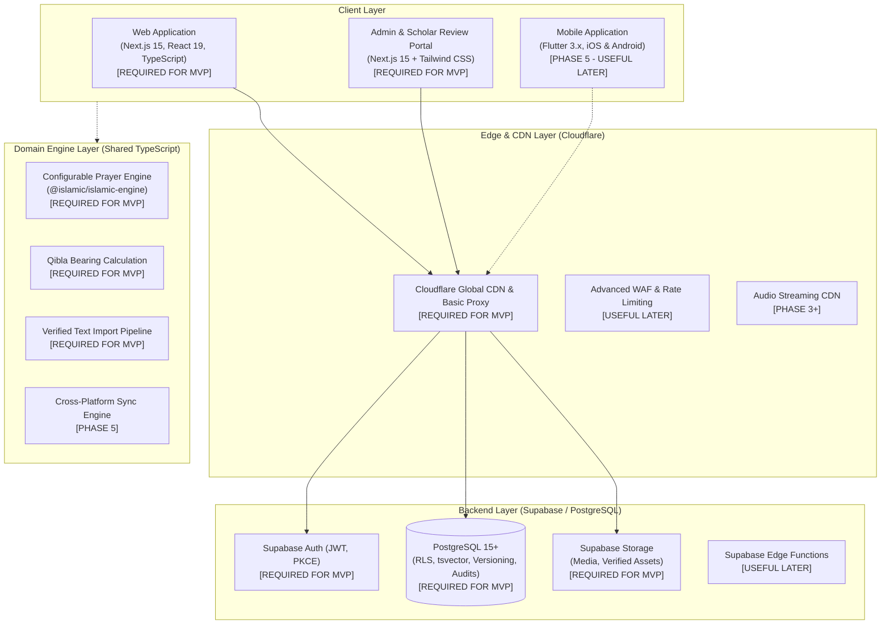
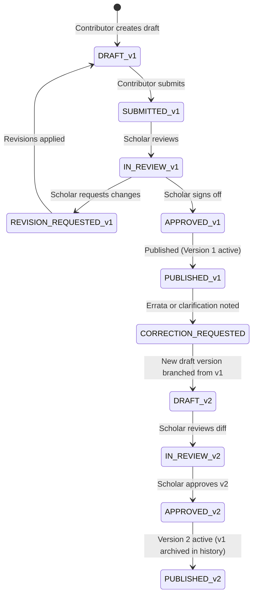
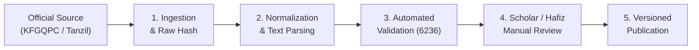
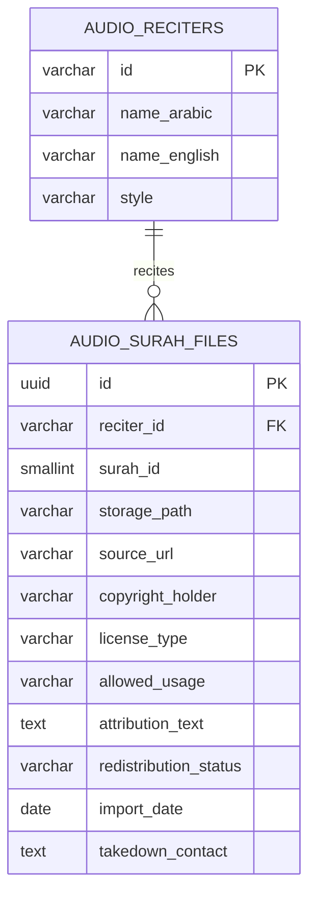
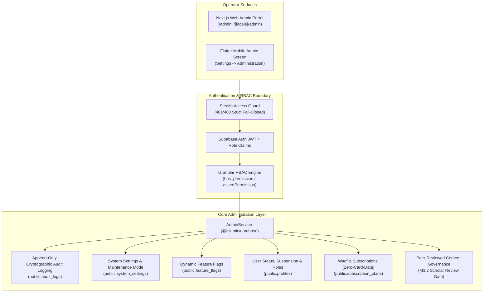

# Architecture Blueprint & System Design
**Project:** Production-Grade Sunni Islamic Digital Platform  
**Status:** Phase 0 Architecture Blueprint (Revision 1)  
**Version:** 1.1.0  

---

## Phase 0 Architecture Review — Revision 1

This section documents the formal architectural adjustments enacted following the initial Phase 0 review:

1. **Pragmatic Technology Phasing (Avoiding Premature Complexity):**
   * **REQUIRED FOR MVP:**
     * Next.js 15 (App Router), React 19, TypeScript 5.x, Tailwind CSS.
     * Supabase (PostgreSQL 15+, Supabase Auth, Row Level Security, Supabase Storage).
     * `pnpm` workspaces for clean package separation.
     * Client-side deterministic prayer calculation engine with configurable methods and local minute offsets.
     * Multi-language internationalization (`next-intl`) supporting Arabic, English, and Urdu with native RTL/LTR styling.
     * Versioned content tables and append-only `audit_logs`.
     * Baseline automated verification scripts for text integrity.
   * **USEFUL LATER (Phase 3–5):**
     * Turborepo build caching across packages.
     * Flutter cross-platform mobile application (iOS & Android).
     * Drift SQLite local persistence on mobile.
     * Native background audio service (`just_audio` / `audio_service`).
     * Cloudflare Enterprise WAF / Advanced Edge Caching rules.
     * Local scheduled push notifications on mobile.
     * Comprehensive multi-role Scholar CMS review portal.
   * **OPTIONAL / FUTURE (Post-Launch):**
     * WebAuthn / FIDO2 hardware token authentication for administrators.
     * Automated offsite GPG-encrypted S3 backup replication pipeline.
     * 3D sensor-fusion magnetometer compass (basic 2D coordinate bearing is sufficient initially).
     * `pgvector` semantic hybrid search (PostgreSQL FTS `tsvector` + `pg_trgm` is sufficient for MVP).
     * Advanced distributed tracing (OpenTelemetry / Jaeger).

2. **Refined MVP Scope Definition:**
   * **Web Experience:** Homepage, Quran Reading (Uthmani & Indo-Pak script, verified translations, word-by-word mapping), Hadith Browser (Kutub al-Sittah, Sanad/Matn view, explicit scholar gradings), Duas & Adhkar (Hisn al-Muslim, repetition counters), Full-Text Search, Knowledge Articles, Authentication (Email/Password, Magic Link), Bookmarks & Reading History, User Profile & Settings, Arabic/English/Urdu localization with RTL/LTR responsiveness.
   * **Backend & Security:** Supabase PostgreSQL, Row Level Security (RLS) enforcing strict user isolation and public scripture access, content provenance metadata, versioning tables, and immutable audit logs.
   * **Admin & Governance:** Authenticated admin/scholar interface for draft submission, revision tracking, scholarly sign-off, and publishing controls.

3. **Web-First but Mobile-Aware Design:**
   * The platform executes Web MVP first, followed by advanced web features, Flutter mobile app, and cross-platform synchronization.
   * **Zero Backend Rework:** All database schemas, primary keys (UUIDs), authentication JWTs, RLS policies, bookmarks, history, and API endpoints are designed from Day 1 to be consumed natively by the future Flutter mobile application.

4. **Controlled Religious Content Versioning:**
   * Replaced the assumption of permanently frozen records with a structured versioning lifecycle:
     $$\text{PUBLISHED v1} \longrightarrow \text{Revision Request} \longrightarrow \text{New Version Draft} \longrightarrow \text{Scholar Review} \longrightarrow \text{Approved} \longrightarrow \text{PUBLISHED v2}$$
   * Previous versions are preserved verbatim with parent pointers, timestamped changelogs, and scholar attribution. Content is never modified silently in-place.

5. **Verified Source / Import Pipeline for Quranic & Religious Text:**
   * Acknowledges that no single digital encoding is universally canonical for all use cases (Uthmani Mushaf, Indo-Pak Mushaf, Tajweed-annotated, search-clean text).
   * Formalizes a verified import pipeline capturing: source identity, edition/version, provenance, normalization rules, checksums, human scholarly verification, publication status, and version history.
   * Clarifies exactly what is hashed: raw source payloads upon import, and normalized character streams for display integrity.

6. **Strict Audio Redistribution & Licensing Framework:**
   * External audio assets must explicitly document: source, copyright holder, license/permission, allowed usage, attribution requirements, redistribution status, import date, and takedown contact.
   * No audio asset is ingested or distributed unless its redistribution rights have been legally verified.

7. **Theological Governance & Transparent Scholarly Differences (Ikhtilaf):**
   * Sunni orthodox framework (Ahl al-Sunnah wa al-Jama'ah) without software inventing theological conclusions.
   * Legitimate differences across recognized Madhhabs (Hanafi, Maliki, Shafi'i, Hanbali) are presented transparently and attributed to primary sources.
   * AI is strictly prohibited from issuing rulings, interpreting theological dilemmas, or auto-publishing religious content.

8. **Configurable Prayer Calculation Architecture:**
   * Decoupled from any single convention. Fully supports configurable calculation methods (MWL, ISNA, Umm al-Qura, Egyptian Authority, Karachi, etc.), Asr madhhab rules (Standard 1x vs Hanafi 2x shadow), high-latitude adjustment formulas, timezones, and manual per-prayer minute offsets, with an extensible provider interface for offline or remote updates.

---

## 1. System Vision & Architecture Principles

This platform is an original, production-grade Sunni Islamic digital ecosystem designed to deliver verified, authoritative Islamic knowledge and devotional tools to Muslims worldwide.

### Core Architectural Principles
* **Authenticity & Provenance (الصحة والتوثيق):** No religious text is ever invented, generated by AI, or published without human scholarly verification and source attribution.
* **Controlled Content Versioning:** Religious content evolves through transparent, audited versions rather than silent in-place edits.
* **Separation of Concerns:** Clear demarcation between canonical religious texts (versioned, cached, read-only to public) and user data (bookmarks, history, preferences).
* **Local-First Devotional Computation:** Prayer times, Qibla bearing, and Hijri dates are calculated using deterministic mathematical algorithms without relying on third-party APIs.
* **Multi-Lingual & Bi-Directional (RTL/LTR):** First-class support for Arabic (العربية), English, and Urdu (اردو).



---

## 2. Monorepo Topology & Project Structure

To maintain clean code sharing between the Web MVP and the future Flutter application, the repository utilizes a lightweight `pnpm` workspace. Turborepo pipeline caching is deferred until multiple packages warrant task orchestration.

```text
islamic-platform/
├── apps/
│   ├── web/                       # Next.js 15+ App Router web application [MVP]
│   │   ├── public/                # Static assets, fonts, icons, manifest
│   │   ├── src/
│   │   │   ├── app/               # Localized App Router pages (/en, /ar, /ur)
│   │   │   │   ├── [locale]/
│   │   │   │   │   ├── page.tsx   # Homepage [MVP]
│   │   │   │   │   ├── quran/     # Quran reader [MVP]
│   │   │   │   │   ├── hadith/    # Hadith browser [MVP]
│   │   │   │   │   ├── duas/      # Duas & Adhkar [MVP]
│   │   │   │   │   ├── prayer/    # Configurable Prayer Times [MVP]
│   │   │   │   │   ├── articles/  # Knowledge base [MVP]
│   │   │   │   │   ├── search/    # Search interface [MVP]
│   │   │   │   │   ├── admin/     # Scholar & Admin CMS [MVP]
│   │   │   │   │   └── profile/   # Bookmarks & Settings [MVP]
│   │   │   ├── components/        # Web UI components & design system
│   │   │   ├── hooks/             # Custom React hooks
│   │   │   └── lib/               # Web utilities
│   │   ├── next.config.ts
│   │   └── package.json
│   │
│   └── mobile/                    # Flutter 3.x cross-platform app [Phase 5 - Mobile Aware]
│       ├── lib/
│       │   ├── core/              # Shared configs, theme, router
│       │   └── features/          # Feature-first modules (quran, hadith, prayer, etc.)
│       └── pubspec.yaml
│
├── packages/
│   ├── islamic-engine/            # Shared TypeScript calculations [MVP]
│   │   ├── src/
│   │   │   ├── prayer/            # Configurable prayer time algorithms
│   │   │   ├── qibla/             # Spherical trigonometric bearing
│   │   │   ├── hijri/             # Umm al-Qura calendar conversion
│   │   │   └── arabic/            # Text normalizer & diacritic stripper
│   │   └── package.json
│   │
│   ├── database/                  # Supabase client wrapper & types [MVP]
│   │   ├── src/
│   │   │   ├── types.ts           # Auto-generated database types
│   │   │   └── client.ts          # Configured Supabase clients (SSR, Client, Admin)
│   │   └── package.json
│   │
│   └── text-verifier/             # Baseline verification scripts [MVP]
│       ├── src/
│       │   ├── verify-quran.ts    # Verify 114 surahs, 6236 ayahs, character streams
│       │   └── verify-sources.ts  # Validate bibliographic source provenance
│       └── package.json
│
├── supabase/
│   ├── migrations/                # Version-controlled SQL migration scripts [MVP]
│   ├── seed.sql                   # Safe baseline seed data (development only)
│   └── config.toml                # Supabase local environment config
│
├── docs/                          # Architectural & governance specifications
└── package.json                   # Monorepo root workspace config (pnpm)
```

---

## 3. Web-First but Mobile-Aware Design

To ensure the future Flutter mobile application (Phase 5) integrates seamlessly without database or API refactoring:

1. **Shared Authentication Model:** Supabase Auth generates standard JWT tokens. The web application stores sessions in secure HTTP-only cookies (SSR) while the Flutter app will store the same JWT in the secure device keystore.
2. **Unified Data Schema:**
   * All user-generated entities (`bookmarks`, `reading_history`, `user_notes`, `user_prayer_settings`) utilize UUID primary keys generated client-side or server-side.
   * Every record includes `client_mutation_id`, `updated_at`, and `deleted_at` (soft-delete flag) to support future bi-directional sync without schema migration.
3. **Identical API Surface:** Next.js Server Actions and Supabase PostgreSQL PostgREST APIs share the exact same database contracts that Flutter will consume via the `supabase_flutter` SDK.

---

## 4. Controlled Religious Content Versioning Architecture

Published religious content (translations, tafsirs, articles, book transcriptions) is **not** treated as permanently immutable records, nor is it ever modified silently in-place.



* **Version Schema Contract (`content_entities` & `content_versions`):**
  * `entity_id`: UUID linking revisions to a persistent logical entity (`content_entities`).
  * `version_number`: Monotonically increasing integer (1, 2, 3...) unique per entity (`uq_entity_version`).
  * `current_version_id`: Foreign key on `content_entities` pointing directly to the active published version. Database trigger strictly enforces that it belongs to the same entity and has `status = 'PUBLISHED'`.
  * `status`: Controlled state lifecycle (`DRAFT`, `IN_REVIEW`, `APPROVED`, `PUBLISHED`, `REJECTED`, `ARCHIVED`). Direct unapproved publishing (`DRAFT/IN_REVIEW/REJECTED -> PUBLISHED`) is strictly blocked by database triggers.
  * `parent_version_id`: UUID pointing to the prior revision of the SAME entity. Database trigger enforces `parent.version_number < child.version_number` and `parent_version_id <> id`, guaranteeing a directed acyclic graph (DAG) with zero cycles.
  * `change_summary`: Explicit human-written justification for the edit (e.g., "Corrected footnote citation").
  * `content_hash`: Authoritative SHA-256 checksum computed database-side over title and normalized JSONB payload; arbitrary client hashes are rejected.
  * `source_provenance`: JSONB field documenting verified physical or digital scholarly edition citations.
  * `reviewed_by` & `reviewed_at`: Foreign key and timestamp of credentialed scholar who signed off on the change. Bound to authenticated caller (`auth.uid()`). Content cannot be modified while in `APPROVED` status.
  * `published_by` & `published_at`: Foreign key and timestamp of administrative publication. Bound to authenticated admin (`auth.uid()`).
  * `prevent_published_content_mutation()`: Engine-level trigger guaranteeing immutability once in `PUBLISHED` or `ARCHIVED` status. Permitted transition is `PUBLISHED -> ARCHIVED` with all content/attribution fields frozen, and only if the version is no longer the active `current_version_id`.

---

## 5. Verified Quran Text Import & Provenance Pipeline

Rather than assuming one digital representation is universal, the platform implements a structured import pipeline that supports multiple verified editions (e.g., KFGQPC Medina Uthmani v1/v2, Indo-Pak Subcontinent 15-line script, Tajweed-annotated, and normalized plain search text).



### Pipeline Steps & Specification:
1. **Source Identity & Provenance:**
   * Every imported dataset documents: `source_name`, `publisher`, `edition_name`, `edition_version`, `source_url`, and `license_type`.
2. **Ingestion & Raw Payload Hashing:**
   * The raw import file (XML/JSON/Unicode text) is hashed with SHA-256 upon arrival to guarantee an immutable provenance record of the upstream source file.
3. **Normalization Rules:**
   * Text is parsed into explicit representations:
     * `text_uthmani`: Medina Mushaf standard with complete vowelization (tashkeel), stop marks (waqf), and sajdah markers.
     * `text_indopak`: Subcontinent calligraphic convention preserving regional vowelization.
     * `text_clean`: Stripped of diacritics and normalized (`إ, أ, آ -> ا`, `ة -> ه`, `ى -> ي`) specifically for full-text search indexing.
4. **Automated Validation Checkpoints:**
   * Verifies exactly 114 Surahs and 6,236 Ayahs.
   * Verifies Surah ayah count boundaries (e.g., Al-Baqarah = 286, Al-Kawthar = 3).
   * Verifies that no control characters or corrupted Unicode glyphs exist in the stream.
5. **Human Scholarly Verification:**
   * Certified Huffaz and scholars inspect rendered test pages against physical print editions before the dataset status transitions to `published`.
6. **Explicit Checksums & Hashes:**
   * **Raw Source File Hash:** Verifies upstream provenance.
   * **Ayah Stream Checksum:** Normalized character-by-character hash stored to detect any unintentional database corruption.
   * The database does not use brittle in-flight triggers that block emergency administrative maintenance; instead, integrity verification runs as part of the audited deployment and import pipeline.

---

## 6. Audio Asset & Licensing Architecture

Audio recitations are treated as licensed digital media assets. No audio file is included or distributed unless its redistribution terms are verified.



* **Redistribution Status:**
  * `verified_permissible`: Explicit open license or verified written permission. Active for public streaming.
  * `unverified_pending`: Under legal review. Inaccessible to public clients.
  * `restricted_takedown`: Suppressed immediately upon copyright inquiry.

---

## 7. Configurable Prayer Calculation Architecture

Prayer time calculations are decoupled from any single standard and are computed client-side with pluggable configuration:

* **Calculation Conventions Supported:**
  * Muslim World League (MWL)
  * Islamic Society of North America (ISNA)
  * Egyptian General Authority of Survey
  * Umm al-Qura University, Makkah
  * University of Islamic Sciences, Karachi
  * Directorate of Religious Affairs, Turkey (Diyanet)
  * Majlis Ugama Islam Singapura (MUIS)
* **Asr Calculation Methods:**
  * Standard / Majority (Shafi'i, Maliki, Hanbali) — Shadow length ratio 1:1.
  * Hanafi — Shadow length ratio 2:1.
* **High-Latitude Adjustment Rules:**
  * Angle-Based Method (1/60th of night per degree).
  * Midnight Method (halfway between sunset and sunrise).
  * One-Seventh Method.
  * None / Strict Astronomical.
* **Manual Minute Offsets:**
  * Users can configure per-prayer minute adjustments (`fajr: +2`, `dhuhr: 0`, `asr: 0`, `maghrib: +3`, `isha: -1`) to match local neighborhood mosque timetables.
* **Pluggable Architecture:** The calculation engine lives in `@islamic/islamic-engine` with a clean interface:
  ```typescript
  interface PrayerCalculationProvider {
    calculate(params: PrayerCalculationParams): PrayerTimesResult;
  }
  ```
  Allows future integration of external verified mosque timetable APIs or municipal calendars without altering client UI code.

---

## 8. Centralized Platform Administration & Operational Architecture

Platform operations are governed by a unified, centralized administration system deployed cross-platform across Next.js Web (`apps/web`), Flutter Mobile (`apps/mobile`), and Supabase Backend (`@islamic/database`).



### 1. Granular Role-Based Access Control (RBAC)
The platform defines six administrative operator roles, structured with distinct privileges:
* `super_admin`: Unrestricted platform governance, system configuration, role assignment, and financial oversight.
* `admin`: Operational platform administration, user support, maintenance toggles, and feature flag management.
* `content_admin`: Editorial coordination, article submissions, and publishing pipeline management.
* `scholar_reviewer`: Theological review of articles and classical texts, revision sign-off, and scholarly commentary (cannot self-approve own submissions).
* `support_admin`: User account lookup, suspension, and account state management (zero access to passwords or encryption keys).
* `billing_admin`: Subscription tier configuration and waqf patronage oversight (zero access to card/CVV numbers).

### 2. Operational Maintenance Mode & Devotional Data Preservation
* When operational maintenance mode is enabled (`MAINTENANCE MODE = ON`), the public status endpoint (`/api/admin/status`) and client notification channels broadcast maintenance state.
* **Strict Devotional State Preservation:** Enabling maintenance mode informs users that remote synchronizations and cloud services are paused, but **never** deletes, truncates, or corrupts local encrypted Drift SQLite databases. Users retain complete offline access to saved Holy Quran bookmarks, reading progress, and local prayer calculations.

### 3. Dynamic Feature Flags Engine
Feature flags are dynamically evaluated from `public.feature_flags` with runtime overrides:
* `audio_streaming`: Live Ayah streaming and verified reciter playback.
* `classical_tafsir`: Comparative tafsir viewer.
* `digital_books`: Classical Sunni book reader.
* `ai_assistance`: Internal editorial drafting tools (strictly gated from approval/publication).
* `waqf_patronage`: Ethical community financial sponsorship tiers.
* `offline_sync`: Bi-directional synchronization engine.

### 4. Ethical Subscriptions & Waqf Patronage (Zero Raw Card Storage)
* Supports community sustaining memberships and Waqf endowments with complete privacy.
* Adheres to strict Zero-Raw-Card-Data policy: payment tokens from PCI-DSS compliant providers only; no card numbers or CVVs are ever received, processed, or persisted by platform databases.

### 5. Stealth Administrative Surfaces & Credential Security
* **Zero Public Admin Buttons:** Public landing pages, navigation bars, and footers contain zero links or visual cues to the admin portal.
* **Web Access:** Accessible via `/admin` and `/[locale]/admin`, returning `noindex, nofollow` headers and enforcing server-side authorization.
* **Mobile Access:** Embedded under `Settings → Administration`, conditionally rendered only when the authenticated local user's role is an authorized administrative role. Unprivileged users receive a 403 Forbidden rejection.
* **Zero Hardcoded Credentials:** No default passwords, backdoor keys, or bypass flags exist in any environment.

