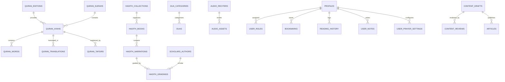

# Database Architecture & Schema Specification
**Project:** Production-Grade Sunni Islamic Digital Platform  
**Engine:** PostgreSQL 15+ (Supabase)  
**Status:** Phase 0 Specification (Revision 1)  
**Version:** 1.1.0  

---

## Phase 0 Architecture Review — Revision 1

This revision incorporates the following concrete database modifications:

1. **Controlled Content Versioning Model:**
   * Transitioned from rigid, in-place immutability to an **audited versioning model**.
   * Non-canonical tables (`articles`, `quran_translations`, `quran_tafsirs`, `book_chapters`) incorporate explicit versioning attributes:
     * `version_number INT NOT NULL DEFAULT 1`
     * `is_current BOOLEAN NOT NULL DEFAULT TRUE`
     * `parent_version_id UUID REFERENCES self(id)`
     * `change_summary TEXT`
     * `verified_by_scholar_id UUID REFERENCES scholars_authors(id)`
     * `published_at TIMESTAMPTZ`
   * Updates to published content branch into new drafts and require scholarly re-approval, preserving all prior revisions in the database.

2. **Verified Quran Source & Edition Pipeline:**
   * Introduced `quran_editions` to track source identity, edition/version, provenance, character set, normalization rules, and scholarly validation sign-off.
   * Clarified checksum hashing: raw source files are hashed upon ingestion for provenance, while individual ayah records maintain a deterministic text checksum for data-at-rest corruption detection.

3. **Strict Audio Asset Licensing Schema:**
   * Replaced generic audio references with a dedicated `audio_assets` table tracking: `source_url`, `copyright_holder`, `license_type`, `allowed_usage`, `attribution_requirement`, `redistribution_status` (`verified_permissible`, `unverified_pending`, `restricted_takedown`), `import_date`, and `takedown_contact`.

4. **Configurable Prayer Time Preferences:**
   * Introduced `user_prayer_settings` supporting configurable calculation methods, Asr madhhab options, high-latitude adjustment formulas, timezone strings, and manual per-prayer minute offsets.

5. **Pragmatic Technology Phasing (Database Layer):**
   * **REQUIRED FOR MVP:** Normalized relational schema, Supabase Auth, Row Level Security (RLS) policies, PostgreSQL Full-Text Search (`tsvector` + `pg_trgm`), versioning columns, and append-only `audit_logs`.
   * **USEFUL LATER:** Automated migration CI testing with pgTAP, Edge Functions, real-time presence subscriptions.
   * **OPTIONAL / FUTURE:** `pgvector` extension and vector embedding columns; complex in-database cryptographic integrity triggers (replaced by pipeline validation scripts).

6. **Mobile-Aware Schema Design:**
   * Tables for user-generated data (`bookmarks`, `reading_history`, `user_notes`, `tasbeeh_sessions`) utilize UUID primary keys, `client_mutation_id`, `updated_at`, and `deleted_at` (soft-deletes) to ensure zero schema friction when the Flutter mobile app connects in Phase 5.

---

## 1. PostgreSQL Extensions & Setup

```sql
-- REQUIRED FOR MVP
CREATE EXTENSION IF NOT EXISTS "uuid-ossp";      -- Standard UUID generation
CREATE EXTENSION IF NOT EXISTS "pgcrypto";       -- Cryptographic utilities
CREATE EXTENSION IF NOT EXISTS "pg_trgm";        -- Trigram matching for fuzzy search & typo tolerance
CREATE EXTENSION IF NOT EXISTS "unaccent";       -- Accent and diacritic handling

-- OPTIONAL / FUTURE (Deferred from MVP)
-- CREATE EXTENSION IF NOT EXISTS "vector";      -- Semantic embeddings (Phase 4+)
-- CREATE EXTENSION IF NOT EXISTS "btree_gist";  -- Advanced exclusion constraints (Phase 4+)
```

---

## 2. Entity-Relationship Model (ERD)



---

## 3. Canonical Religious Schema

### 3.1 Quran Schema & Source Provenance

#### `quran_editions` [REQUIRED FOR MVP]
Tracks verified source editions of the Quranic text.
```sql
CREATE TABLE quran_editions (
    id VARCHAR(50) PRIMARY KEY,             -- 'kfgqpc-v2-uthmani', 'tanzil-clean', 'subcontinent-indopak'
    name VARCHAR(150) NOT NULL,             -- 'Medina Mushaf (KFGQPC v2)'
    publisher VARCHAR(150) NOT NULL,        -- 'King Fahd Glorious Quran Printing Complex'
    edition_version VARCHAR(30) NOT NULL,   -- '2.0.1'
    script_type VARCHAR(30) NOT NULL,       -- 'uthmani', 'indopak', 'clean'
    source_url TEXT NOT NULL,
    raw_source_sha256 CHAR(64) NOT NULL,   -- SHA-256 of original source file upon ingest
    normalization_rules JSONB NOT NULL,     -- e.g. {"strip_tatweel": true, "unify_alif": false}
    verified_by_scholar_id UUID REFERENCES scholars_authors(id),
    status VARCHAR(30) NOT NULL DEFAULT 'published',
    created_at TIMESTAMPTZ NOT NULL DEFAULT NOW()
);
```

#### `quran_surahs` [REQUIRED FOR MVP]
```sql
CREATE TABLE quran_surahs (
    id SMALLINT PRIMARY KEY,                 -- 1 to 114
    slug VARCHAR(50) NOT NULL UNIQUE,       -- 'al-fatihah', 'al-baqarah'
    name_arabic VARCHAR(100) NOT NULL,      -- الفاتحة
    name_english VARCHAR(100) NOT NULL,     -- The Opening
    name_transliteration VARCHAR(100) NOT NULL, -- Al-Faatiha
    name_urdu VARCHAR(100) NOT NULL,        -- سورۃ الفاتحہ
    revelation_type VARCHAR(10) NOT NULL CHECK (revelation_type IN ('meccan', 'medinan')),
    ayahs_count SMALLINT NOT NULL,          -- e.g. 7
    rukus_count SMALLINT NOT NULL,          -- e.g. 1
    page_start SMALLINT NOT NULL,           -- Medina Mushaf page (1 to 604)
    page_end SMALLINT NOT NULL,
    created_at TIMESTAMPTZ NOT NULL DEFAULT NOW()
);
```

#### `quran_ayahs` [REQUIRED FOR MVP]
```sql
CREATE TABLE quran_ayahs (
    id INT PRIMARY KEY,                      -- Global ayah index (1 to 6236)
    edition_id VARCHAR(50) NOT NULL REFERENCES quran_editions(id),
    surah_id SMALLINT NOT NULL REFERENCES quran_surahs(id),
    ayah_number SMALLINT NOT NULL,          -- 1 to 286
    text_uthmani TEXT NOT NULL,             -- Uthmani script with full diacritics
    text_indopak TEXT,                      -- Subcontinent calligraphic convention
    text_clean TEXT NOT NULL,               -- Normalized plain text for fast FTS search
    juz_number SMALLINT NOT NULL,           -- 1 to 30
    hizb_number SMALLINT NOT NULL,          -- 1 to 60
    rub_number SMALLINT NOT NULL,           -- 1 to 240
    ruku_number SMALLINT NOT NULL,
    page_number SMALLINT NOT NULL,          -- 1 to 604
    sajdah BOOLEAN NOT NULL DEFAULT FALSE,
    sajdah_obligation VARCHAR(20) DEFAULT NULL,
    text_checksum CHAR(64) NOT NULL,        -- SHA-256 of text_uthmani for corruption detection
    search_vector tsvector GENERATED ALWAYS AS (
        to_tsvector('arabic', text_clean)
    ) STORED,
    CONSTRAINT uq_surah_ayah UNIQUE (surah_id, ayah_number)
);

CREATE INDEX idx_quran_ayahs_surah ON quran_ayahs(surah_id, ayah_number);
CREATE INDEX idx_quran_ayahs_page ON quran_ayahs(page_number);
CREATE INDEX idx_quran_ayahs_search ON quran_ayahs USING GIN (search_vector);
CREATE INDEX idx_quran_ayahs_trgm ON quran_ayahs USING GIN (text_clean gin_trgm_ops);
```

#### `quran_words` [REQUIRED FOR MVP]
Word-by-word mapping for translations and UI interaction.
```sql
CREATE TABLE quran_words (
    id BIGSERIAL PRIMARY KEY,
    ayah_id INT NOT NULL REFERENCES quran_ayahs(id),
    position_in_ayah SMALLINT NOT NULL,
    text_uthmani VARCHAR(150) NOT NULL,
    transliteration VARCHAR(200),
    translation_en VARCHAR(250),
    translation_ur VARCHAR(250),
    CONSTRAINT uq_ayah_word UNIQUE (ayah_id, position_in_ayah)
);

CREATE INDEX idx_quran_words_ayah ON quran_words(ayah_id, position_in_ayah);
```

#### `quran_translations` [REQUIRED FOR MVP — Versioned]
```sql
CREATE TABLE quran_translations (
    id UUID PRIMARY KEY DEFAULT gen_random_uuid(),
    ayah_id INT NOT NULL REFERENCES quran_ayahs(id),
    language_code VARCHAR(10) NOT NULL,     -- 'en', 'ur'
    author_id UUID NOT NULL REFERENCES scholars_authors(id),
    translation_text TEXT NOT NULL,
    footnotes TEXT,
    license_id VARCHAR(50) NOT NULL,
    version_number INT NOT NULL DEFAULT 1,
    is_current BOOLEAN NOT NULL DEFAULT TRUE,
    parent_version_id UUID REFERENCES quran_translations(id),
    change_summary TEXT,
    verified_by_scholar_id UUID REFERENCES scholars_authors(id),
    published_at TIMESTAMPTZ NOT NULL DEFAULT NOW(),
    search_vector tsvector GENERATED ALWAYS AS (
        to_tsvector('english', translation_text)
    ) STORED
);

CREATE INDEX idx_quran_trans_lookup ON quran_translations(ayah_id, language_code) WHERE is_current = TRUE;
CREATE INDEX idx_quran_trans_search ON quran_translations USING GIN (search_vector) WHERE is_current = TRUE;
```

---

### 3.2 Hadith Schema [REQUIRED FOR MVP]

```sql
CREATE TABLE hadith_collections (
    id VARCHAR(50) PRIMARY KEY,             -- 'bukhari', 'muslim', 'abu-dawud', 'tirmidhi', 'nasai', 'ibn-majah'
    name_arabic VARCHAR(150) NOT NULL,
    name_english VARCHAR(150) NOT NULL,
    name_urdu VARCHAR(150) NOT NULL,
    author_id UUID NOT NULL REFERENCES scholars_authors(id),
    total_hadiths INT NOT NULL,
    description TEXT,
    created_at TIMESTAMPTZ NOT NULL DEFAULT NOW()
);

CREATE TABLE hadith_books (
    id BIGSERIAL PRIMARY KEY,
    collection_id VARCHAR(50) NOT NULL REFERENCES hadith_collections(id),
    book_number INT NOT NULL,
    name_arabic VARCHAR(200) NOT NULL,
    name_english VARCHAR(200) NOT NULL,
    name_urdu VARCHAR(200) NOT NULL,
    hadith_start_number INT NOT NULL,
    hadith_end_number INT NOT NULL,
    CONSTRAINT uq_collection_book UNIQUE (collection_id, book_number)
);

CREATE TABLE hadith_narrations (
    id BIGSERIAL PRIMARY KEY,
    collection_id VARCHAR(50) NOT NULL REFERENCES hadith_collections(id),
    book_id BIGINT NOT NULL REFERENCES hadith_books(id),
    hadith_number INT NOT NULL,
    in_book_reference VARCHAR(50),
    international_number INT,               -- Darussalam numbering
    chapter_title_arabic TEXT,
    chapter_title_english TEXT,
    sanad_arabic TEXT,                      -- Chain of narrators
    matn_arabic TEXT NOT NULL,              -- Text of narration
    matn_clean TEXT NOT NULL,               -- Stripped for FTS search
    translation_english TEXT,
    translation_urdu TEXT,
    source_edition TEXT NOT NULL,
    version_number INT NOT NULL DEFAULT 1,
    is_current BOOLEAN NOT NULL DEFAULT TRUE,
    parent_version_id BIGINT REFERENCES hadith_narrations(id),
    search_vector tsvector GENERATED ALWAYS AS (
        to_tsvector('arabic', matn_clean)
    ) STORED,
    created_at TIMESTAMPTZ NOT NULL DEFAULT NOW(),
    CONSTRAINT uq_collection_hadith UNIQUE (collection_id, hadith_number, version_number)
);

CREATE TABLE hadith_gradings (
    id BIGSERIAL PRIMARY KEY,
    hadith_id BIGINT NOT NULL REFERENCES hadith_narrations(id),
    scholar_id UUID NOT NULL REFERENCES scholars_authors(id),
    grade VARCHAR(50) NOT NULL,             -- 'Sahih', 'Hasan', 'Daif'
    grade_arabic VARCHAR(50) NOT NULL,      -- 'صحيح', 'حسن', 'ضعيف'
    scholarly_commentary TEXT,
    reference_source VARCHAR(255) NOT NULL, -- Exact volume, page, edition
    created_at TIMESTAMPTZ NOT NULL DEFAULT NOW()
);

CREATE INDEX idx_hadith_lookup ON hadith_narrations(collection_id, hadith_number) WHERE is_current = TRUE;
CREATE INDEX idx_hadith_search ON hadith_narrations USING GIN (search_vector) WHERE is_current = TRUE;
CREATE INDEX idx_hadith_gradings ON hadith_gradings(hadith_id);
```

---

### 3.3 Duas & Adhkar Schema [REQUIRED FOR MVP]

```sql
CREATE TABLE dua_categories (
    id VARCHAR(50) PRIMARY KEY,
    parent_id VARCHAR(50) REFERENCES dua_categories(id),
    slug VARCHAR(100) NOT NULL UNIQUE,
    title_arabic VARCHAR(150) NOT NULL,
    title_english VARCHAR(150) NOT NULL,
    title_urdu VARCHAR(150) NOT NULL,
    icon_slug VARCHAR(50),
    sort_order SMALLINT NOT NULL DEFAULT 0
);

CREATE TABLE duas (
    id BIGSERIAL PRIMARY KEY,
    category_id VARCHAR(50) NOT NULL REFERENCES dua_categories(id),
    slug VARCHAR(150) NOT NULL UNIQUE,
    title_english VARCHAR(255) NOT NULL,
    title_urdu VARCHAR(255) NOT NULL,
    arabic_text TEXT NOT NULL,
    transliteration TEXT NOT NULL,
    translation_english TEXT NOT NULL,
    translation_urdu TEXT NOT NULL,
    target_count SMALLINT NOT NULL DEFAULT 1,
    benefit_note TEXT,
    reference_source TEXT NOT NULL,          -- e.g. 'Hisn al-Muslim (Abu Dawud 5068)'
    verified_by_scholar_id UUID NOT NULL REFERENCES scholars_authors(id),
    version_number INT NOT NULL DEFAULT 1,
    is_current BOOLEAN NOT NULL DEFAULT TRUE,
    created_at TIMESTAMPTZ NOT NULL DEFAULT NOW()
);

CREATE INDEX idx_duas_category ON duas(category_id) WHERE is_current = TRUE;
```

---

### 3.4 Audio Assets & Verified Licensing [USEFUL LATER / PHASE 3+]

```sql
CREATE TABLE audio_reciters (
    id VARCHAR(50) PRIMARY KEY,             -- 'alafasy', 'al-husary', 'abdul-basit'
    name_arabic VARCHAR(150) NOT NULL,
    name_english VARCHAR(150) NOT NULL,
    style VARCHAR(50) DEFAULT 'murattal',   -- 'murattal', 'mujawwad'
    bio TEXT,
    is_active BOOLEAN NOT NULL DEFAULT TRUE
);

CREATE TABLE audio_assets (
    id UUID PRIMARY KEY DEFAULT gen_random_uuid(),
    reciter_id VARCHAR(50) NOT NULL REFERENCES audio_reciters(id),
    surah_id SMALLINT NOT NULL REFERENCES quran_surahs(id),
    ayah_number SMALLINT,                   -- null if full-surah audio
    storage_path VARCHAR(500) NOT NULL,
    source_url TEXT NOT NULL,
    copyright_holder VARCHAR(255),
    license_type VARCHAR(100) NOT NULL,     -- e.g. 'Public Domain / Free Islamic Waqf'
    allowed_usage VARCHAR(100) NOT NULL,    -- 'Non-commercial streaming and downloading'
    attribution_requirement TEXT,
    redistribution_status VARCHAR(50) NOT NULL DEFAULT 'unverified_pending'
        CHECK (redistribution_status IN ('verified_permissible', 'unverified_pending', 'restricted_takedown')),
    import_date DATE NOT NULL DEFAULT CURRENT_DATE,
    takedown_contact VARCHAR(255) NOT NULL DEFAULT 'legal@islamicplatform.org',
    created_at TIMESTAMPTZ NOT NULL DEFAULT NOW()
);

CREATE INDEX idx_audio_lookup ON audio_assets(reciter_id, surah_id, ayah_number) 
WHERE redistribution_status = 'verified_permissible';
```

---

## 4. User Profiles, Preferences & Mobile-Aware Data

### 4.1 `profiles` & `user_prayer_settings` [REQUIRED FOR MVP]

```sql
CREATE TABLE profiles (
    id UUID PRIMARY KEY REFERENCES auth.users(id) ON DELETE CASCADE,
    username VARCHAR(50) UNIQUE,
    full_name VARCHAR(100),
    preferred_locale VARCHAR(10) NOT NULL DEFAULT 'en',
    preferred_mushaf VARCHAR(20) NOT NULL DEFAULT 'uthmani',
    created_at TIMESTAMPTZ NOT NULL DEFAULT NOW(),
    updated_at TIMESTAMPTZ NOT NULL DEFAULT NOW()
);

CREATE TABLE user_prayer_settings (
    id UUID PRIMARY KEY DEFAULT gen_random_uuid(),
    user_id UUID NOT NULL REFERENCES auth.users(id) ON DELETE CASCADE,
    calculation_method VARCHAR(50) NOT NULL DEFAULT 'MWL',
    asr_madhhab VARCHAR(20) NOT NULL DEFAULT 'standard' CHECK (asr_madhhab IN ('standard', 'hanafi')),
    high_latitude_rule VARCHAR(30) NOT NULL DEFAULT 'angle_based' 
        CHECK (high_latitude_rule IN ('angle_based', 'midnight', 'one_seventh', 'none')),
    latitude DOUBLE PRECISION,
    longitude DOUBLE PRECISION,
    city_name VARCHAR(100),
    timezone VARCHAR(50) NOT NULL DEFAULT 'UTC',
    fajr_offset_minutes SMALLINT NOT NULL DEFAULT 0,
    dhuhr_offset_minutes SMALLINT NOT NULL DEFAULT 0,
    asr_offset_minutes SMALLINT NOT NULL DEFAULT 0,
    maghrib_offset_minutes SMALLINT NOT NULL DEFAULT 0,
    isha_offset_minutes SMALLINT NOT NULL DEFAULT 0,
    updated_at TIMESTAMPTZ NOT NULL DEFAULT NOW(),
    CONSTRAINT uq_user_prayer_settings UNIQUE (user_id)
);
```

### 4.2 Mobile-Ready User Personal Library [REQUIRED FOR MVP]

All user tables include `client_mutation_id`, `updated_at`, and `deleted_at` so the future Flutter app can sync deltas using Last-Write-Wins without any database alterations.

```sql
CREATE TABLE bookmarks (
    id UUID PRIMARY KEY DEFAULT gen_random_uuid(),
    user_id UUID NOT NULL REFERENCES auth.users(id) ON DELETE CASCADE,
    entity_type VARCHAR(30) NOT NULL CHECK (entity_type IN ('ayah', 'hadith', 'dua', 'article')),
    entity_reference VARCHAR(100) NOT NULL, -- e.g. '2:255', 'bukhari:1'
    custom_title VARCHAR(200),
    folder_name VARCHAR(50) DEFAULT 'Favorites',
    client_mutation_id UUID,                -- for client offline sync idempotency
    updated_at TIMESTAMPTZ NOT NULL DEFAULT NOW(),
    deleted_at TIMESTAMPTZ,                 -- soft delete flag for sync
    created_at TIMESTAMPTZ NOT NULL DEFAULT NOW(),
    CONSTRAINT uq_user_bookmark UNIQUE (user_id, entity_type, entity_reference)
);

CREATE TABLE reading_history (
    id UUID PRIMARY KEY DEFAULT gen_random_uuid(),
    user_id UUID NOT NULL REFERENCES auth.users(id) ON DELETE CASCADE,
    surah_id SMALLINT NOT NULL REFERENCES quran_surahs(id),
    ayah_number SMALLINT NOT NULL,
    page_number SMALLINT NOT NULL,
    scroll_position_pct FLOAT DEFAULT 0.0,
    client_mutation_id UUID,
    last_read_at TIMESTAMPTZ NOT NULL DEFAULT NOW(),
    CONSTRAINT uq_user_history UNIQUE (user_id, surah_id)
);

CREATE TABLE user_notes (
    id UUID PRIMARY KEY DEFAULT gen_random_uuid(),
    user_id UUID NOT NULL REFERENCES auth.users(id) ON DELETE CASCADE,
    ayah_id INT REFERENCES quran_ayahs(id),
    hadith_id BIGINT REFERENCES hadith_narrations(id),
    note_text TEXT NOT NULL,
    is_private BOOLEAN NOT NULL DEFAULT TRUE,
    client_mutation_id UUID,
    updated_at TIMESTAMPTZ NOT NULL DEFAULT NOW(),
    deleted_at TIMESTAMPTZ,
    created_at TIMESTAMPTZ NOT NULL DEFAULT NOW()
);
```

---

## 5. Content Management, Versioning & Review Workflow

In Milestone 1.3, the platform implements a generalized, reusable content versioning and audit model supporting multi-stage editorial workflows across all content types (articles, tafsir entries, translations, and guides).

### 5.1 Content Entities (Logical Identity)
Tracks the persistent identity, type, slug, and currently published active version pointer of a content item.

```sql
CREATE TABLE public.content_entities (
    id UUID PRIMARY KEY DEFAULT gen_random_uuid(),
    content_type VARCHAR(50) NOT NULL, -- e.g. 'article', 'translation', 'tafsir_entry', 'general'
    slug VARCHAR(200),
    created_by UUID NOT NULL REFERENCES auth.users(id),
    created_at TIMESTAMPTZ NOT NULL DEFAULT NOW(),
    updated_at TIMESTAMPTZ NOT NULL DEFAULT NOW(),
    current_version_id UUID,           -- Points to the active published content_versions(id)
    CONSTRAINT uq_content_slug_type UNIQUE (content_type, slug)
);

CREATE INDEX idx_content_entities_type ON public.content_entities (content_type);
```

### 5.2 Content Versions (Revision Lifecycle & Immutability)
Captures every draft, review iteration, approved state, published release, or archived revision. Once published or archived, revisions cannot be modified in place.

```sql
CREATE TABLE public.content_versions (
    id UUID PRIMARY KEY DEFAULT gen_random_uuid(),
    entity_id UUID NOT NULL REFERENCES public.content_entities(id) ON DELETE CASCADE,
    version_number INT NOT NULL CHECK (version_number >= 1),
    status VARCHAR(30) NOT NULL DEFAULT 'DRAFT'
        CHECK (status IN ('DRAFT', 'IN_REVIEW', 'APPROVED', 'PUBLISHED', 'REJECTED', 'ARCHIVED')),
    title VARCHAR(255) NOT NULL,
    content_payload JSONB NOT NULL,
    content_hash CHAR(64),            -- SHA-256 checksum of canonical content payload
    change_summary TEXT,               -- Explanation of edits/revisions
    source_provenance JSONB NOT NULL DEFAULT '{}'::jsonb, -- Physical or verified digital citation
    parent_version_id UUID REFERENCES public.content_versions(id),
    created_by UUID NOT NULL REFERENCES auth.users(id),
    created_at TIMESTAMPTZ NOT NULL DEFAULT NOW(),
    reviewed_by UUID REFERENCES auth.users(id),
    reviewed_at TIMESTAMPTZ,
    review_notes TEXT,
    published_by UUID REFERENCES auth.users(id),
    published_at TIMESTAMPTZ,
    CONSTRAINT uq_entity_version UNIQUE (entity_id, version_number),
    CONSTRAINT chk_reviewed_consistency CHECK (
        (status NOT IN ('APPROVED', 'PUBLISHED')) OR 
        (reviewed_by IS NOT NULL AND reviewed_at IS NOT NULL)
    ),
    CONSTRAINT chk_published_consistency CHECK (
        (status != 'PUBLISHED') OR 
        (published_by IS NOT NULL AND published_at IS NOT NULL)
    )
);

CREATE INDEX idx_content_versions_entity ON public.content_versions (entity_id, version_number DESC);
CREATE INDEX idx_content_versions_status ON public.content_versions (status);
CREATE INDEX idx_content_versions_parent ON public.content_versions (parent_version_id);
```

### 5.3 Audit Logs (Immutable Append-Only Security Trail)
Records non-repudiable events for security, authentication, role assignment, and editorial lifecycle transitions.

```sql
CREATE TABLE public.audit_logs (
    id UUID PRIMARY KEY DEFAULT gen_random_uuid(),
    actor_id UUID REFERENCES auth.users(id) ON DELETE SET NULL,
    action VARCHAR(100) NOT NULL,
    target_entity_type VARCHAR(100) NOT NULL,
    target_entity_id VARCHAR(100),
    correlation_id UUID,
    details JSONB NOT NULL DEFAULT '{}'::jsonb,
    source_context VARCHAR(100),
    created_at TIMESTAMPTZ NOT NULL DEFAULT NOW()
);

CREATE INDEX idx_audit_logs_actor ON public.audit_logs (actor_id, created_at DESC);
CREATE INDEX idx_audit_logs_target ON public.audit_logs (target_entity_type, target_entity_id);
CREATE INDEX idx_audit_logs_action ON public.audit_logs (action, created_at DESC);
CREATE INDEX idx_audit_logs_created_at ON public.audit_logs (created_at DESC);
```

### 5.4 Immutability & Lifecycle Triggers (M1.3 Hardened)

```sql
-- Forbids in-place UPDATE or DELETE on audit logs
CREATE OR REPLACE FUNCTION public.prevent_audit_log_mutation()
RETURNS TRIGGER AS $$
BEGIN
    RAISE EXCEPTION 'Immutable Audit Log: UPDATE and DELETE operations are strictly prohibited on public.audit_logs.';
END;
$$ LANGUAGE plpgsql SET search_path = public, pg_temp;

CREATE TRIGGER trg_audit_logs_immutability
BEFORE UPDATE OR DELETE ON public.audit_logs
FOR EACH ROW EXECUTE FUNCTION public.prevent_audit_log_mutation();

-- F-01: Validates that current_version_id references a PUBLISHED version belonging to the same entity
CREATE TRIGGER trg_validate_content_entity_current_version
BEFORE INSERT OR UPDATE OF current_version_id ON public.content_entities
FOR EACH ROW EXECUTE FUNCTION public.validate_content_entity_current_version();

-- F-02: Forbids modification of ARCHIVED versions; permits PUBLISHED -> ARCHIVED transition
-- while strictly freezing all content, lineage, metadata, and attribution fields.
CREATE TRIGGER trg_content_versions_immutability
BEFORE UPDATE ON public.content_versions
FOR EACH ROW EXECUTE FUNCTION public.prevent_published_content_mutation();

-- F-03: Validates parent_version_id (same entity, no self-parent, monotonic parent.version_number < child.version_number)
CREATE TRIGGER trg_content_versions_parent_validate
BEFORE INSERT OR UPDATE OF parent_version_id, entity_id, version_number ON public.content_versions
FOR EACH ROW EXECUTE FUNCTION public.validate_content_version_parent();

-- F-04, F-05, F-06: Finite-state machine and role-gated field protections
-- Protects identity/lineage fields, ensures only APPROVED -> PUBLISHED, freezes approved content, binds reviewer/publisher
CREATE TRIGGER trg_content_versions_lifecycle
BEFORE UPDATE ON public.content_versions
FOR EACH ROW EXECUTE FUNCTION public.enforce_content_version_lifecycle();

-- Authoritative Cryptographic Content Hash Derivation & Validation
-- Derives SHA-256 over title and canonical JSONB payload; rejects arbitrary/mismatched client hashes
CREATE TRIGGER trg_content_versions_hash_enforce
BEFORE INSERT OR UPDATE OF title, content_payload, content_hash ON public.content_versions
FOR EACH ROW EXECUTE FUNCTION public.enforce_content_version_hash();

-- Automated Append-Only Audit Logging Triggers
CREATE TRIGGER trg_audit_content_version_lifecycle
AFTER INSERT OR UPDATE ON public.content_versions
FOR EACH ROW EXECUTE FUNCTION public.audit_content_version_lifecycle();

CREATE TRIGGER trg_audit_content_entity_current_version
AFTER UPDATE OF current_version_id ON public.content_entities
FOR EACH ROW EXECUTE FUNCTION public.audit_content_entity_current_version();
```

---

## 6. Row Level Security (RLS) Policies [REQUIRED FOR MVP]

```sql
ALTER TABLE quran_editions ENABLE ROW LEVEL SECURITY;
ALTER TABLE quran_surahs ENABLE ROW LEVEL SECURITY;
ALTER TABLE quran_ayahs ENABLE ROW LEVEL SECURITY;
ALTER TABLE quran_translations ENABLE ROW LEVEL SECURITY;
ALTER TABLE hadith_narrations ENABLE ROW LEVEL SECURITY;
ALTER TABLE bookmarks ENABLE ROW LEVEL SECURITY;
ALTER TABLE reading_history ENABLE ROW LEVEL SECURITY;
ALTER TABLE user_notes ENABLE ROW LEVEL SECURITY;
ALTER TABLE user_prayer_settings ENABLE ROW LEVEL SECURITY;
ALTER TABLE content_entities ENABLE ROW LEVEL SECURITY;
ALTER TABLE content_versions ENABLE ROW LEVEL SECURITY;
ALTER TABLE audit_logs ENABLE ROW LEVEL SECURITY;

-- 1. Public Read Access to Published Canonical Content
CREATE POLICY "Public read-only current quran ayahs"
ON quran_ayahs FOR SELECT TO public USING (true);

CREATE POLICY "Public read-only current quran translations"
ON quran_translations FOR SELECT TO public USING (is_current = TRUE);

CREATE POLICY "Public read-only current hadith"
ON hadith_narrations FOR SELECT TO public USING (is_current = TRUE);

-- 2. User Isolation on Personal Data
CREATE POLICY "Users isolate own bookmarks"
ON bookmarks FOR ALL TO authenticated
USING (auth.uid() = user_id)
WITH CHECK (auth.uid() = user_id);

CREATE POLICY "Users isolate own reading history"
ON reading_history FOR ALL TO authenticated
USING (auth.uid() = user_id)
WITH CHECK (auth.uid() = user_id);

CREATE POLICY "Users isolate own prayer settings"
ON user_prayer_settings FOR ALL TO authenticated
USING (auth.uid() = user_id)
WITH CHECK (auth.uid() = user_id);

-- 3. Content Entities & Versions Policies (M1.3)
-- Public can view content entities with an active published version
CREATE POLICY "Public can view published content entities"
ON content_entities FOR SELECT TO public
USING (current_version_id IS NOT NULL);

-- Public can view PUBLISHED and ARCHIVED versions
CREATE POLICY "Public can view published and archived versions"
ON content_versions FOR SELECT TO public
USING (status IN ('PUBLISHED', 'ARCHIVED'));

-- Staff roles can view, draft, review, or publish according to role
CREATE POLICY "Staff can view all content versions"
ON content_versions FOR SELECT TO authenticated
USING (public.has_any_role(auth.uid(), ARRAY['super_admin', 'content_admin', 'scholar_reviewer', 'editor', 'translator']));

-- 4. Audit Logs Access
CREATE POLICY "Admins can view audit logs"
ON audit_logs FOR SELECT TO authenticated
USING (public.has_any_role(auth.uid(), ARRAY['super_admin', 'content_admin']));
```

---

## 9. Full-Text Search (FTS) & Citation Router Indexes (M2.5)

Migration: `supabase/migrations/20260923000005_fts_search_citation_router.sql`

To facilitate high-performance search across Arabic scriptures, Urdu translations, and English translations without degrading the canonical raw data, the following PostgreSQL GIN indexes and RPC procedures are implemented:

```sql
-- Quran Ayahs Clean Arabic FTS
CREATE INDEX IF NOT EXISTS idx_quran_ayahs_fts_arabic
ON quran_ayahs USING GIN (to_tsvector('simple', text_clean));

-- Quran Translations English FTS
CREATE INDEX IF NOT EXISTS idx_quran_translations_fts_english
ON quran_translations USING GIN (to_tsvector('english', translation_text))
WHERE edition_id = 'en.sahih';

-- Quran Translations Urdu FTS
CREATE INDEX IF NOT EXISTS idx_quran_translations_fts_urdu
ON quran_translations USING GIN (to_tsvector('simple', translation_text))
WHERE edition_id = 'ur.jalandhry';

-- Hadith Narrations Arabic Matn FTS
CREATE INDEX IF NOT EXISTS idx_hadith_narrations_fts_arabic
ON hadith_narrations USING GIN (to_tsvector('simple', matn_arabic));

-- Hadith Narrations English Translation FTS
CREATE INDEX IF NOT EXISTS idx_hadith_narrations_fts_english
ON hadith_narrations USING GIN (to_tsvector('english', coalesce(translation_english, '')));

-- Duas & Adhkar Clean Arabic FTS
CREATE INDEX IF NOT EXISTS idx_duas_adhkar_fts_arabic
ON duas_adhkar USING GIN (to_tsvector('simple', coalesce(arabic_clean, arabic_text)));

-- Duas & Adhkar English Translation FTS
CREATE INDEX IF NOT EXISTS idx_duas_adhkar_fts_english
ON duas_adhkar USING GIN (to_tsvector('english', coalesce(english_translation, '')));

-- Database Function: search_islamic_corpus(p_query, p_type, p_limit, p_offset)
-- Returns: TABLE(id text, type text, reference text, title text, arabic_text text, english_text text, urdu_text text, score double precision)
```

---

## Milestone 4.3: Digital Islamic Books e-Reader Schema

Milestone 4.3 introduces a structured digital book reading hierarchy, edition-level licensing provenance, and private user reading progress tracking.

```sql
-- Core Entities
public.books (
    id VARCHAR(100) PRIMARY KEY,
    slug VARCHAR(100) NOT NULL UNIQUE,
    title_arabic VARCHAR(300) NOT NULL,
    title_english VARCHAR(300) NOT NULL,
    title_urdu VARCHAR(300) NOT NULL,
    author_name_arabic VARCHAR(250) NOT NULL,
    author_death_year_ah SMALLINT,
    category VARCHAR(50) NOT NULL,
    volume_count SMALLINT NOT NULL DEFAULT 1,
    license_type VARCHAR(100) NOT NULL DEFAULT 'Public Domain',
    license_status VARCHAR(50) NOT NULL DEFAULT 'verified_permissible',
    review_status VARCHAR(30) NOT NULL DEFAULT 'approved',
    publication_status VARCHAR(30) NOT NULL DEFAULT 'published'
);

public.book_editions (
    id UUID PRIMARY KEY DEFAULT gen_random_uuid(),
    book_id VARCHAR(100) NOT NULL REFERENCES public.books(id),
    edition_identifier VARCHAR(150) NOT NULL,
    edition_title VARCHAR(300) NOT NULL,
    language_code VARCHAR(10) NOT NULL DEFAULT 'ar',
    format VARCHAR(30) NOT NULL DEFAULT 'structured_text',
    license_status VARCHAR(50) NOT NULL DEFAULT 'verified_permissible',
    content_sha256 CHAR(64),
    CONSTRAINT uq_book_edition UNIQUE (book_id, edition_identifier, language_code)
);

public.book_volumes (
    id UUID PRIMARY KEY DEFAULT gen_random_uuid(),
    book_id VARCHAR(100) NOT NULL REFERENCES public.books(id),
    volume_number SMALLINT NOT NULL DEFAULT 1,
    CONSTRAINT uq_book_volume UNIQUE (book_id, edition_id, volume_number)
);

public.book_sections (
    id UUID PRIMARY KEY DEFAULT gen_random_uuid(),
    book_id VARCHAR(100) NOT NULL REFERENCES public.books(id),
    volume_number SMALLINT NOT NULL DEFAULT 1,
    section_number INT NOT NULL,
    title_arabic VARCHAR(300) NOT NULL,
    chapter_number INT,
    start_page INT,
    end_page INT,
    CONSTRAINT uq_book_section UNIQUE (book_id, edition_id, volume_number, section_number)
);

public.book_contents (
    id UUID PRIMARY KEY DEFAULT gen_random_uuid(),
    section_id UUID NOT NULL REFERENCES public.book_sections(id),
    book_id VARCHAR(100) NOT NULL REFERENCES public.books(id),
    paragraph_index INT NOT NULL DEFAULT 1,
    content_type VARCHAR(30) NOT NULL DEFAULT 'paragraph',
    content_availability VARCHAR(30) NOT NULL DEFAULT 'metadata_only',
    license_status VARCHAR(50) NOT NULL DEFAULT 'verified_permissible',
    publication_status VARCHAR(30) NOT NULL DEFAULT 'published',
    is_current BOOLEAN NOT NULL DEFAULT TRUE
);

public.user_reading_progress (
    id UUID PRIMARY KEY DEFAULT gen_random_uuid(),
    user_id UUID NOT NULL REFERENCES auth.users(id) ON DELETE CASCADE,
    book_id VARCHAR(100) NOT NULL REFERENCES public.books(id) ON DELETE CASCADE,
    progress_percentage NUMERIC(5,2) NOT NULL DEFAULT 0.00,
    last_read_at TIMESTAMPTZ NOT NULL DEFAULT NOW(),
    CONSTRAINT uq_user_book_progress UNIQUE (user_id, book_id)
);

-- Library Bookmarks integration
ALTER TABLE public.bookmarks ADD CONSTRAINT bookmarks_content_type_check
    CHECK (content_type IN ('quran', 'hadith', 'dua', 'article', 'book'));
```

---

## 11. Centralized Administration, RBAC & Subscription Architecture

Implemented in migration `20260925000001_admin_system_rbac_config_subscriptions.sql` for Milestone 4.5.

### 11.1 Enhanced Role-Based Access Control (RBAC)
```sql
-- Role Expansion
ALTER TABLE public.user_roles DROP CONSTRAINT IF EXISTS user_roles_role_check;
ALTER TABLE public.user_roles ADD CONSTRAINT user_roles_role_check
    CHECK (role IN (
        'user', 
        'scholar_reviewer', 
        'content_admin', 
        'super_admin',
        'admin',
        'support_admin',
        'billing_admin'
    ));

-- Role Permissions Mapping
CREATE TABLE IF NOT EXISTS public.role_permissions (
    id UUID PRIMARY KEY DEFAULT gen_random_uuid(),
    role VARCHAR(50) NOT NULL,
    permission VARCHAR(100) NOT NULL,
    description TEXT,
    created_at TIMESTAMPTZ NOT NULL DEFAULT NOW(),
    CONSTRAINT uq_role_permission UNIQUE (role, permission)
);

-- Fast Security Definer Permission Helpers
CREATE OR REPLACE FUNCTION public.is_admin(lookup_uid UUID DEFAULT auth.uid())
RETURNS BOOLEAN LANGUAGE plpgsql SECURITY DEFINER SET search_path = public, pg_temp AS $$
BEGIN
    RETURN EXISTS (
        SELECT 1 FROM public.user_roles
        WHERE user_id = lookup_uid
          AND role IN ('super_admin', 'admin', 'content_admin', 'scholar_reviewer', 'support_admin', 'billing_admin')
    );
END;
$$;

CREATE OR REPLACE FUNCTION public.has_permission(lookup_uid UUID, required_perm VARCHAR)
RETURNS BOOLEAN LANGUAGE plpgsql SECURITY DEFINER SET search_path = public, pg_temp AS $$
BEGIN
    IF EXISTS (SELECT 1 FROM public.user_roles WHERE user_id = lookup_uid AND role = 'super_admin') THEN
        RETURN TRUE;
    END IF;
    RETURN EXISTS (
        SELECT 1 FROM public.user_roles ur
        JOIN public.role_permissions rp ON rp.role = ur.role
        WHERE ur.user_id = lookup_uid AND rp.permission = required_perm
    );
END;
$$;
```

### 11.2 System Settings & Dynamic Feature Flags
```sql
-- Singleton System Settings
CREATE TABLE IF NOT EXISTS public.system_settings (
    id VARCHAR(32) PRIMARY KEY DEFAULT 'primary',
    maintenance_mode BOOLEAN NOT NULL DEFAULT FALSE,
    maintenance_message TEXT NOT NULL DEFAULT 'Platform undergoing scheduled maintenance. Please check back shortly.',
    registration_enabled BOOLEAN NOT NULL DEFAULT TRUE,
    min_supported_mobile_version VARCHAR(20) NOT NULL DEFAULT '1.0.0',
    min_supported_web_version VARCHAR(20) NOT NULL DEFAULT '1.0.0',
    created_at TIMESTAMPTZ NOT NULL DEFAULT NOW(),
    updated_at TIMESTAMPTZ NOT NULL DEFAULT NOW()
);

-- Dynamic Feature Flags
CREATE TABLE IF NOT EXISTS public.feature_flags (
    id UUID PRIMARY KEY DEFAULT gen_random_uuid(),
    key VARCHAR(100) NOT NULL UNIQUE,
    name VARCHAR(200) NOT NULL,
    description TEXT,
    is_enabled BOOLEAN NOT NULL DEFAULT FALSE,
    environment VARCHAR(50) NOT NULL DEFAULT 'production',
    created_at TIMESTAMPTZ NOT NULL DEFAULT NOW(),
    updated_at TIMESTAMPTZ NOT NULL DEFAULT NOW()
);
```

### 11.3 Ethical Subscriptions & Waqf Patronage (Zero Raw Card Storage)
```sql
-- Subscription Plans
CREATE TABLE IF NOT EXISTS public.subscription_plans (
    id VARCHAR(64) PRIMARY KEY,
    name VARCHAR(100) NOT NULL,
    description TEXT,
    price_cents INT NOT NULL DEFAULT 0,
    currency VARCHAR(10) NOT NULL DEFAULT 'USD',
    interval VARCHAR(20) NOT NULL DEFAULT 'month',
    is_active BOOLEAN NOT NULL DEFAULT TRUE,
    is_waqf_patronage BOOLEAN NOT NULL DEFAULT FALSE,
    features JSONB NOT NULL DEFAULT '[]'::jsonb,
    created_at TIMESTAMPTZ NOT NULL DEFAULT NOW()
);

-- User Subscriptions (Tokenized Only — Zero PAN / CVV Storage)
CREATE TABLE IF NOT EXISTS public.user_subscriptions (
    id UUID PRIMARY KEY DEFAULT gen_random_uuid(),
    user_id UUID NOT NULL REFERENCES auth.users(id) ON DELETE CASCADE,
    plan_id VARCHAR(64) NOT NULL REFERENCES public.subscription_plans(id),
    status VARCHAR(50) NOT NULL DEFAULT 'active',
    payment_provider VARCHAR(50) NOT NULL DEFAULT 'stripe',
    provider_customer_id VARCHAR(255),
    provider_subscription_id VARCHAR(255),
    current_period_start TIMESTAMPTZ NOT NULL DEFAULT NOW(),
    current_period_end TIMESTAMPTZ NOT NULL,
    cancel_at_period_end BOOLEAN NOT NULL DEFAULT FALSE,
    created_at TIMESTAMPTZ NOT NULL DEFAULT NOW(),
    updated_at TIMESTAMPTZ NOT NULL DEFAULT NOW(),
    CONSTRAINT uq_user_plan_active UNIQUE (user_id, plan_id)
);
```

