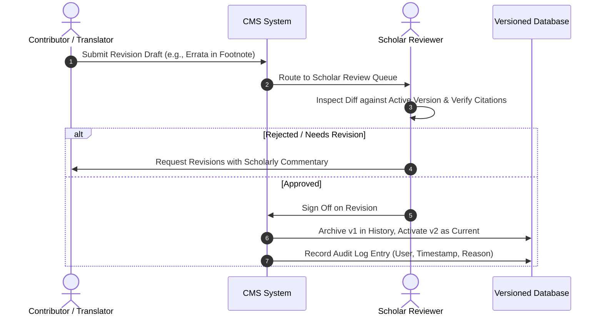

# Religious Content Policy & Scholarly Governance
**Platform:** ISLAM UL HARAMAIN (إسلام الحرمين)  
**Project:** Production-Grade Sunni Islamic Digital Platform  
**Master Charter:** [`docs/ISLAMIC_METHODOLOGY.md`](file:///d:/ISLAMIC-PLATFORM/docs/ISLAMIC_METHODOLOGY.md)  
**Theological Framework:** Ahl al-Sunnah wa al-Jama'ah (أهل السنة والجماعة)  
**Status:** Mandatory Platform Standard (Revision 2)  
**Version:** 2.0.0  

---

## Phase 0 Architecture Review — Revision 1

This revision incorporates the following governance enhancements:

1. **Explicit Sourcing & Attribution Mandate:**
   * The software platform is strictly an engineering medium; it **must not invent theological conclusions, formulate fatwas, or declare novel consensus**.
   * Every religious claim, ruling, Hadith grading, scholarly position, and translation must be rigorously sourced and attributed to recognized classical or contemporary scholars and verified publications.

2. **Transparent Representation of Legitimate Scholarly Differences (الأدب مع الخلاف الفقهي):**
   * Where legitimate scholarly differences exist among the recognized Sunni schools of jurisprudence (Hanafi, Maliki, Shafi'i, Hanbali) or classical theologians, the platform **must represent them transparently**.
   * The system will not silently present one specific scholarly opinion as universally accepted while ignoring legitimate classical differences. Variations (e.g. Asr prayer calculation times, recitation of Al-Fatiha in congregational prayer, wudu invalidators) will be presented with clear attribution to their respective Madhhabs and classical jurists.

3. **Controlled Content Versioning Lifecycle:**
   * Published content is **not** treated as permanently uncorrectable. Typographical errata, footnote enhancements, or improved translation wordings follow a controlled, audited versioning process:
     $$\text{PUBLISHED v1} \longrightarrow \text{Correction Request} \longrightarrow \text{New Version Draft} \longrightarrow \text{Scholar Review} \longrightarrow \text{Approved} \longrightarrow \text{PUBLISHED v2}$$
   * Previous versions remain accessible in the audit history. Silent in-place edits are strictly prohibited.

4. **Multi-Edition Scripture Pipeline:**
   * Recognizes that different valid digital representations of the Holy Quran serve different authentic use cases (e.g., Medina Uthmani Mushaf, Indo-Pak Subcontinent Mushaf, and clean search text).
   * Ingestion requires full source provenance, edition tracking, and human scholarly verification before publication.

5. **Inviolable AI Governance:**
   * **AI must NEVER automatically publish religious content.**
   * **AI must NEVER act as a Mufti, religious judge, or theological interpreter.**

---

## 1. Foundational Creed & Guiding Principles

This platform operates in strict adherence to the Holy Quran and the authentic Sunnah as understood by the righteous predecessors (Salaf al-Salih) and the consensus of the scholars of **Ahl al-Sunnah wa al-Jama'ah**.

### Core Inviolable Rules
1. **Zero Religious Invention:** Never invent, fabricate, approximate, or modify any Quranic verse, Hadith narration, chain of transmission (Sanad), legal ruling (Fatwa), theological position, or scholar attribution.
2. **Mandatory Sourcing & Provenance:** Every piece of religious content must cite verifiable bibliographic metadata (Title, Author, Edition, Volume, Page, In-book number, and International reference).
3. **Transparent Scholarly Pluralism:** Where the four Sunni schools of jurisprudence differ, present the views respectfully with attribution to classical authorities (e.g., Imam Abu Hanifa, Imam Malik, Imam al-Shafi'i, Imam Ahmad ibn Hanbal) rather than arbitrarily selecting one viewpoint as universal dogma.
4. **Prohibition of Autonomous AI Authority:**
   * AI systems are strictly prohibited from generating Fatwas, issuing religious edicts, or answering theological dilemmas independently.
   * AI-assisted suggestions must undergo human scholar review prior to publication.

---

## 2. Quranic Text & Verified Ingestion Standards

### 2.1 Multi-Representation Authenticity
* **Primary Reference:** The Hafs 'an 'Asim (حفص عن عاصم) narration according to the **Medina Mushaf** issued by the **King Fahd Glorious Quran Printing Complex (KFGQPC)**.
* **Supported Valid Representations:**
  * **Uthmani Script (الرسم العثماني):** Exact Medina Mushaf diacritical and orthographic standard with complete pause marks (waqf) and sajdah indicators.
  * **Indo-Pak Script (الرسم الباكستاني):** Subcontinent calligraphic tradition verified letter-for-letter against the Medina standard to support South Asian readers.
  * **Clean Search Text (النص المجرد للبحث):** Diacritic-stripped, normalized text specifically indexed for fault-tolerant search queries.
* **Integrity Gate:** Total verse count across all representations must equal exactly **6,236 Ayahs** across **114 Surahs**. Any discrepancy triggers an immediate deployment abort.

### 2.2 Translations & Commentary
* Translations must originate exclusively from vetted, orthodox scholars and translators (e.g., Saheeh International, Maulana Fateh Muhammad Jalandhari).
* All modern footnotes and explanatory additions must be visually distinguished from the translated text of divine revelation.
* Classical Tafsirs (Ibn Kathir, Al-Tabari, Al-Qurtubi, Al-Sa'di) must cite the specific published edition and translator where applicable.

---

## 3. Hadith Authenticity & Grading Standards

### 3.1 Collections Covered
* Primary Kutub al-Sittah: *Sahih al-Bukhari*, *Sahih Muslim*, *Sunan Abi Dawud*, *Jami` at-Tirmidhi*, *Sunan an-Nasa'i*, *Sunan Ibn Majah*.
* Supplementary collections: *Muwatta Imam Malik*, *Riyad al-Salihin*, Imam an-Nawawi's *Forty Hadith*.

### 3.2 Authenticity Gradings (أحكام المحدثين)
* **Mandatory Grading Badge:** Every narration must display its authenticity grade (*Sahih*, *Hasan*, *Da'if*) alongside the evaluating scholar (e.g., Shaykh al-Albani, Shaykh Shu'ayb al-Arna'ut, Darussalam research committee).
* **Fabricated (Mawdu') Traditions:** Strictly banned from the platform, except within dedicated scholarly educational articles warning the public about widespread fabrications.
* **Weak (Da'if) Traditions:**
  * Strictly prohibited in matters of Creed (Aqeedah) and Legal Rulings (Halal/Haram).
  * If included in sections covering virtues of righteous deeds (Fada'il al-A'mal), they must bear a prominent visual indicator: **[ضعيف - Da'if / Weak]**, adhering to the conditions established by Imam al-Nawawi and Ibn Hajar.

---

## 4. Controlled Religious Content Versioning

To ensure transparency and maintain auditability, religious content evolves through a controlled lifecycle:

---

## 5. Ethical Guidelines for Artificial Intelligence

| AI Capability | Permissible? | Conditions & Safeguards |
|---|:---:|---|
| **Query Understanding & Normalization** | ✅ Yes | Maps user keywords to existing scripture indexes. Never synthesizes religious content. |
| **Manuscript OCR & Digitization Aid** | ✅ Yes | Accelerated transcription; 100% human proofreading required before drafting. |
| **Linguistic & Grammar Check** | ✅ Yes | Validated against classical dictionaries and verified corpus baselines. |
| **Automated Publishing of Religious Text** | ❌ **PROHIBITED** | No AI agent or automated script may publish religious content without human scholar sign-off. |
| **Issuing Fatwas or Religious Opinions** | ❌ **PROHIBITED** | AI cannot understand spiritual context, intention, or divine wisdom and must never simulate a Mufti. |
| **Theological Extrapolation** | ❌ **PROHIBITED** | Interpretations must be verbatim citations of classical commentators. |
