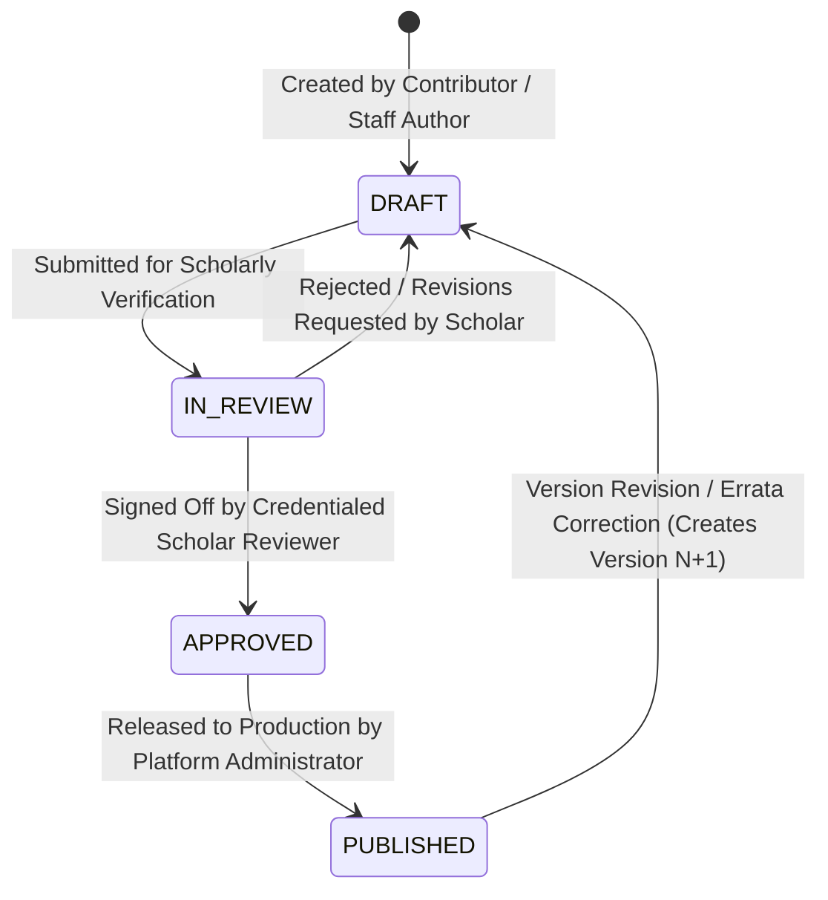

# Religious Content Review & Scholarly Governance Workflow
**Platform:** ISLAM UL HARAMAIN (إسلام الحرمين)  
**Document Type:** Editorial Governance & Scholar Verification Protocol  
**Document Version:** 2.0.0 (Revised Specification)  
**Authority:** Approved by Project Owner  
**Date:** September 2026 / Rabi' al-Awwal 1448 AH  

---

## 1. Tripartite Governance Framework

Editorial and review operations enforce the distinction between:
* **Category A (Owner Approved):** Methodological mandate for human scholarly review and strict AI limitations.
* **Category B (Requires Scholarly Verification):** All substantive religious conclusions, Hadith gradings, and fatwas requiring source verification before publication.
* **Category C (Architectural Governance Rules):** Database statuses, RLS policies, role separation, and immutability triggers.

---

## 2. Differentiated Content Types & Verification Requirements [Category C: Architectural Rule]

Not every piece of content has identical verification mechanics. The system distinguishes content types:

| Content Type | Attribution & Source Requirement | Verification Gate |
| :--- | :--- | :--- |
| **Primary Revelation (Qur'an)** | King Fahd Glorious Quran Printing Complex (KFGQPC) Medina Mushaf standard. Exact 6,236 Ayahs. | Batch cryptographic corpus certification. Individual scholar ID per Ayah is not required. |
| **Hadith Narration** | Canonical collection reference (Kutub al-Sittah, etc.), Sanad, Matn, and attributed grading from a verified Hadith scholar. | Scholar reviewer verifies Sanad and attribution against primary Hadith compendiums. |
| **Classical Scholarly Quotation** | Book Title, Author, Volume, Page, Publisher, and verified Arabic text. | Reviewer confirms physical publication metadata (zero hallucination tolerance). |
| **Fiqh Ruling / Mas'alah** | School of law, Mu'tamad position, classical reference manual, volume/page. | Credentialed scholar reviewer verifies alignment with school's recognized Usul. |
| **Contemporary Fatwa** | Sponsoring Fatwa council or certified Mufti, date, original text, and context. | Editorial verification of official council publication. |
| **Historical Report** | Source chroniclers, transmission chain evaluation, alternative historical accounts. | Dual-scholar review for sensitive historical events (Al-Fitnah, Mu'awiyah, Yazid). |
| **Editorial Explanation** | Sourced educational synthesis citing classical Sunni authorities. | Editorial scholar sign-off. |
| **AI-Assisted Draft** | Explicitly marked in metadata (`draft_source: 'AI_ASSISTED'`). | 100% human verification required before moving from DRAFT to IN_REVIEW. |

---

## 3. Four-Stage Lifecycle & Role Separation [Category C: Architectural Rule]

All content entities transition through four distinct, database-enforced lifecycle states:

### 3.1 Role Boundaries (Enforced by Database RLS & API Middleware)
1. **Contributor / Staff Author (`author`):** Can create and edit content in `DRAFT` status. Cannot transition content to `APPROVED` or `PUBLISHED`.
2. **Scholar Reviewer (`reviewer`):** Credentialed Islamic scholar. Can review `IN_REVIEW` drafts, annotate revisions, and transition content to `APPROVED`. Cannot be the author of the same content item (Separation of Duties).
3. **Platform Administrator (`admin` / `super_admin`):** Releases `APPROVED` content to `PUBLISHED` status. Cannot approve drafts without a valid `reviewer_scholar_id` where required.
4. **Database Immutability:** Once a record reaches `PUBLISHED` status, database triggers prevent in-place modifications to content fields. Any corrections require creating a new revision row (Version $N+1$).

---

## 4. Scholar Reviewer Verification Checklist [Category C: Architectural Rule]

Before certifying an item to `APPROVED` status, the scholar reviewer must verify:

- [ ] **Textual Fidelity:** The Quranic Arabic text, Hadith Matn, or classical quote is 100% accurate, letter-for-letter, with verified diacritics.
- [ ] **Physical Citation Verification:** The cited source exists in a published edition with exact Book Title, Author, Volume, Page, and Publisher. (Zero hallucinated citations).
- [ ] **Attribution Accuracy:** The opinion is correctly attributed to the stated Imam, Madhhab, or scholar without misrepresentation.
- [ ] **Contextual Integrity:** The quote is not stripped of essential context or qualifiers.
- [ ] **Controversy Indicator Assignment:** The item is correctly tagged with 🟢 Green, 🟡 Yellow, 🟠 Orange, or 🔴 Red status according to the platform's methodology charter.
- [ ] **Adab with Khilaf:** If the topic is contested among Sunni authorities, alternative recognized views are represented respectfully without sectarian bias.
- [ ] **Historical Restraint:** Historical narratives regarding Sahabah and early Fitnah conform to the verified Sunni rules of academic restraint and fairness.
- [ ] **Monotheistic Safeguards:** All discussions of Tawassul, Awliya, Karamat, and Shafa'ah clearly affirm that independent divine power (*al-qudrah al-dhatiyyah al-mustaqillah*) belongs solely to Allah.

---

## 5. Inviolable AI Safeguards & Restrictions [Category A & Category C]

### 5.1 Permissible AI Capabilities
* Search and semantic indexing over verified content.
* Organizing and formatting human-reviewed data.
* Summarizing verified classical content without adding novel interpretations.
* Assisting human contributors with drafting and transcription proofreading.
* Identifying potential citations in library catalogs for human scholarly review.

### 5.2 Inviolable AI Restrictions
* **AI may NOT independently issue a fatwa.**
* **AI may NOT create an Islamic ruling and present it as authoritative.**
* **AI may NOT manufacture citations or bibliographic metadata.**
* **AI may NOT declare Ijma' (consensus) or lack thereof.**
* **AI may NOT declare takfir on any individual or group.**
* **AI may NOT silently classify a disputed matter into a controversy color.**
* **AI may NOT publish religious content without human scholar approval.**
