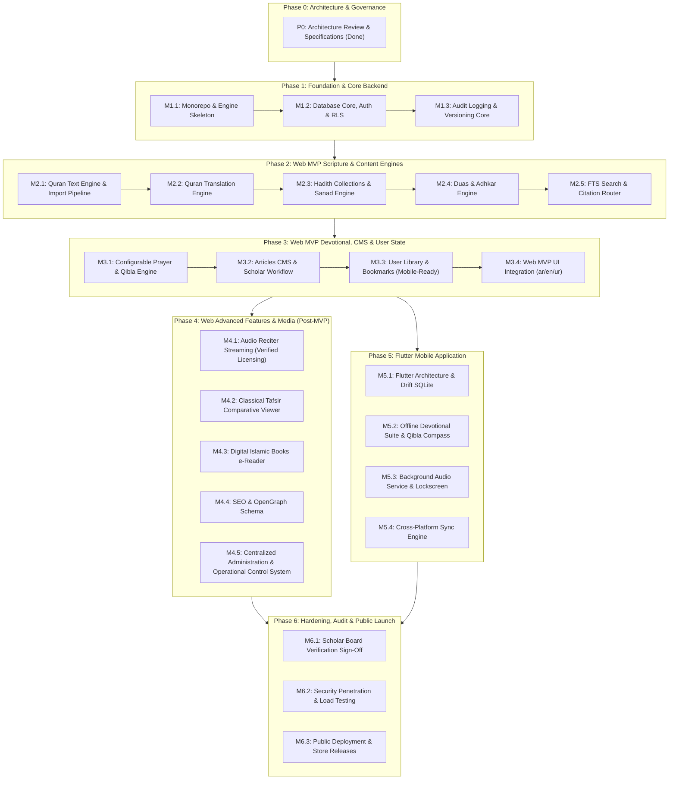

# Platform Implementation Roadmap & Lifecycle
**Project:** Production-Grade Sunni Islamic Digital Platform  
**Status:** Phase 0 Baseline Roadmap (Revision 1)  
**Version:** 1.1.0  

---

## Phase 0 Architecture Review — Revision 1

This revised roadmap establishes a disciplined, phased execution strategy with granular milestones. 
* **Single Domain per Milestone:** In direct response to architectural review, no single milestone will bundle massive scripture corpuses simultaneously. Quran text, translations, hadith, duas, and tafsir are developed in distinct, sequential, testable milestones.
* **Granular Milestone Contract:** Every milestone explicitly defines:
  1. Objective
  2. Affected systems
  3. Dependencies
  4. Implementation tasks
  5. Tests
  6. Acceptance criteria
  7. Rollback considerations
* **Strict Web-First Progression:** 
  $$\text{Foundation (P1)} \longrightarrow \text{Web Scripture & Content MVP (P2)} \longrightarrow \text{Web Devotional & User MVP (P3)} \longrightarrow \text{Web Advanced / Audio (P4)} \longrightarrow \text{Flutter Mobile (P5)} \longrightarrow \text{Audit & Launch (P6)}$$

---

## Phase 1: Foundation, Workspace & Backend Core

### Milestone 1.1: Monorepo Workspace & Engine Skeleton
* **Objective:** Initialize lightweight monorepo workspace and package layouts without heavy overhead.
* **Affected Systems:** Root workspace (`pnpm-workspace.yaml`), `packages/islamic-engine`, `packages/database`.
* **Dependencies:** Node.js v24+, pnpm.
* **Implementation Tasks:**
  * Configure `pnpm-workspace.yaml` and root `package.json`.
  * Scaffold `@islamic/islamic-engine` with strict TypeScript configuration.
  * Scaffold `@islamic/database` package shell.
* **Tests:** Unit tests verifying workspace build and basic TypeScript exports.
* **Acceptance Criteria:** `pnpm test` and `pnpm lint` succeed cleanly across all packages.
* **Rollback Considerations:** Revert root workspace configuration; zero production data affected.

---

### Milestone 1.2: Supabase Schema, Auth Core & RLS Isolation
* **Objective:** Establish the foundational PostgreSQL schema with authentication and secure RLS policies.
* **Affected Systems:** Supabase configuration, PostgreSQL database migrations.
* **Dependencies:** Milestone 1.1.
* **Implementation Tasks:**
  * Author migrations for `profiles`, `user_roles`, and `user_prayer_settings`.
  * Enable RLS on all tables with strict `auth.uid() = user_id` isolation.
  * Configure Supabase Auth with PKCE and session cookie support.
* **Tests:** Automated pgTAP / SQL tests asserting that unauthorized reads/writes across user IDs are rejected.
* **Acceptance Criteria:** 100% pass on user isolation tests; valid JWT returns expected role claims.
* **Rollback Considerations:** Roll back migration scripts via Supabase CLI down-migrations.

---

### Milestone 1.3: Audit Logging & Content Versioning Infrastructure
* **Objective:** Create the reusable database foundation for content versioning, auditability, and scholar-review workflows.
* **Affected Systems:** `supabase/migrations/20260922000002_audit_logging_versioning.sql`, `supabase/migrations/20260922000003_m1_3_integrity_hardening.sql`, `supabase/migrations/20260922000004_m1_3_content_hash_integrity.sql`, `packages/database/src/types.ts`, `supabase/tests/rls_versioning_audit_test.sql`.
* **Dependencies:** Milestone 1.2.
* **Implementation Tasks:**
  * Implement non-recursive role verification helper `public.has_any_role(lookup_uid, check_roles)` with safe `search_path = public, pg_temp;`.
  * Author append-only `public.audit_logs` schema protected by engine-level trigger `prevent_audit_log_mutation()` and populated via `public.record_audit_event()`.
  * Author generic `public.content_entities` and `public.content_versions` schema supporting DAG parent lineage, metadata, hashes, and status constraints (`DRAFT`, `IN_REVIEW`, `APPROVED`, `PUBLISHED`, `REJECTED`, `ARCHIVED`).
  * Enforce revision immutability and archival via `prevent_published_content_mutation()` trigger.
  * Enforce active version pointer integrity on `content_entities.current_version_id` via `validate_content_entity_current_version()` trigger (F-01).
  * Enforce DAG parent integrity and cycle prevention via `validate_content_version_parent()` trigger (F-03).
  * Enforce finite-state machine transitions, draft author protections, approved content freezing, and publication gates via `enforce_content_version_lifecycle()` trigger (F-02, F-04, F-05, F-06).
  * Authoritative cryptographic derivation and validation of `content_hash` via `calculate_content_hash()` and `trg_content_versions_hash_enforce`.
  * Automated append-only audit logging triggers on version lifecycle transitions and pointer updates.
  * Establish RLS policies for role-segregated drafting, scholarly review, publication, and administrative audit inspection.
  * Export TypeScript DTOs (`ContentEntity`, `ContentVersionEntity`, `AuditLogEntry`, `ContentStatus`) from `@islamic/database`.
  * Author executable SQL test suite in `supabase/tests/rls_versioning_audit_test.sql` covering all findings, cryptographic hash integrity, and legitimate transitions.
* **Tests:** Automated SQL assertions testing audit immutability, version creation, status transitions, role-based RLS boundaries, content hash derivation/validation, and F-01 through F-06 hardening.
* **Acceptance Criteria:** Typecheck and build pass cleanly; immutable triggers protect audit records and published revisions; no circular RLS recursion or trigger deadlocks.
* **Rollback Considerations:** Revert migrations `20260922000002`, `20260922000003`, and `20260922000004` via Supabase migration rollback; zero canonical scripture affected.

---

## Phase 2: Web MVP Scripture & Content Engines (Single-Domain Milestones)

### Milestone 2.1: Quran Text Engine & Verified Import Pipeline
* **Status:** COMPLETE / LOCKED (Formally Closed & Verified)
* **Objective:** Build the verified source import pipeline and ingest the canonical Holy Quran text.
* **Affected Systems:** `quran_editions`, `quran_surahs`, `quran_ayahs`, `quran_juzs`, `quran_rub_el_hizbs`, `quran_manzils`, `quran_pages`, `quran_sajdas`, `supabase/migrations/20260923000001_quran_text_engine.sql`, `packages/database/src/ingest/import-quran.ts`, `packages/islamic-engine/src/quran/`.
* **Dependencies:** Milestone 1.3.
* **Implementation Tasks:**
  * Created normalized Quran database schema with edition metadata, surahs, ayahs, and structural divisions (Juz, Rub, Manzil, Page, Sajda).
  * Enforced dual text representation: source-verbatim (`text_source_verbatim` with source Bismillah preserved) and structural (`text_uthmani`).
  * Engineered database-level read-only protection (`trg_prevent_quran_text_mutation` trigger and RLS public SELECT-only).
  * Built deterministic XML streaming ingest pipeline verifying Tanzil Quran Uthmani (v1.1) and Tanzil Metadata (v1.0) with strict source SHA-256 verification.
  * Computed SHA-256 hashes per Ayah and validated full-dataset canonical checksum (`53e832613ffa0ee5d9c9c1a395154a5abde668fb1e9c73396d8a7034881af0bb`).
  * Generated 5.28 MB self-contained reproducible database seed (`supabase/seed_quran.sql`).
  * Implemented pure TypeScript search normalizer (`normalizeQuranSearchText`) stripping harakat, tatweel, and normalizing orthography.
  * Implemented Sajdah classification neutrality (recording raw Tanzil attributes without universalizing fiqh rulings).
* **Tests:** 23 automated tests (17 in `islamic-engine`, 6 in `database`) validating Surah metadata, Ayah bounds, Kufan numbering, cryptographic checksums, search normalization, and immutable RLS/triggers.
* **Acceptance Criteria:** Exactly 114 Surahs and 6,236 Ayahs verified against reference Kufan Hafs 'an 'Asim baseline with zero discrepancies and 100% test coverage.
* **Rollback Considerations:** Clear `quran_ayahs` and `quran_editions` records without affecting user tables.

---

### Milestone 2.2: Quran Translation Engine & Verified Bilingual Ingestion
* **Status:** COMPLETE / LOCKED (Formally Closed & Verified)
* **Objective:** Implement verified, immutable, bilingual Quran translations (English: Saheeh International, Urdu: Maulana Fateh Muhammad Jalandhari) with source verification, cryptographic checksums, database constraints, and UI integration.
* **Affected Systems:** `quran_translation_editions`, `quran_translations`, `supabase/migrations/20260923000002_quran_translation_engine.sql`, `supabase/seed_quran_translations.sql`, `supabase/tests/quran_translation_engine_test.sql`, `packages/islamic-engine/src/quran/translation-*.ts`, `packages/database/src/quran/tanzil-translation-parser.ts`, `packages/database/src/ingest/import-translations.ts`, `apps/web/src/app/quran/[surahId]/page.tsx`, `apps/web/src/lib/quran.ts`.
* **Dependencies:** Milestone 2.1.
* **Implementation Tasks:**
  * Created normalized translation database schema (`quran_translation_editions`, `quran_translations`) with foreign key constraints `ON DELETE RESTRICT` against canonical `quran_ayahs`.
  * Implemented database-level immutability triggers (`trg_prevent_translation_edition_mutation`, `trg_prevent_translation_mutation`) and cryptographic Ayah translation verification trigger (`trg_verify_quran_translation_checksum`).
  * Enforced RLS: read-only public access to published editions (`status = 'published'`), modifications restricted to `super_admin`.
  * Built pure TypeScript translation engine with SHA-256 checksums, dataset validators, and boundary verification.
  * Ingested Saheeh International (`en.sahih`) and Maulana Fateh Muhammad Jalandhari (`ur.jalandhry`) from verified Tanzil sources with raw source hash checks.
  * Proved 100% character equivalence between Tanzil XML and TXT distributions across all 6,236 Ayahs.
  * Preserved source-verbatim translation text without search normalization or lossy manipulation.
  * Generated deterministic 3.59 MB reproducible database seed (`supabase/seed_quran_translations.sql`) containing exactly 12,472 translations.
  * Implemented Next.js bilingual Quran reader UI with distinct human translation rendering, proper LTR/RTL font styling, source attribution, and cryptographic badges.
* **Tests:** 38 automated tests (12 in `islamic-engine`, 26 in `database` across boundary cases, pipeline execution, XML/TXT consistency, tampering detection, and dataset validation).
* **Acceptance Criteria:** Exactly 6,236 translated Ayahs per edition verified against canonical Ayah IDs; zero Arabic Quran data modified; 100% automated test pass.
* **Rollback Considerations:** Drop `quran_translations` and `quran_translation_editions` via migration rollback; zero canonical Arabic Quran text affected.

---

### Milestone 2.3: Hadith Collections Engine & Grading Attribution
* **Status:** COMPLETE / LOCKED (Formally Implemented & Verified)
* **Objective:** Build the production Hadith computational engine supporting the canonical Kutub al-Sittah (Sahih al-Bukhari, Sahih Muslim, Sunan Abi Dawud, Jami` at-Tirmidhi, Sunan an-Nasa'i, Sunan Ibn Majah), rigorous Sanad/Matn separation, SHA-256 cryptographic text checksums, and multi-scholar authenticity gradings (Al-Albani, Shu'ayb al-Arna'ut, Ahmad Shakir, Zubair Ali Zai, Darussalam Research Committee).
* **Affected Systems:** `public.scholars_authors`, `public.hadith_collections`, `public.hadith_books`, `public.hadith_narrations`, `public.hadith_gradings`, `supabase/migrations/20260923000003_hadith_collections_engine.sql`, `supabase/seed_hadith.sql`, `supabase/tests/hadith_engine_test.sql`, `packages/islamic-engine/src/hadith/`, `packages/database/src/hadith/`, `packages/database/src/ingest/import-hadith.ts`, `packages/database/src/ingest/cli-seed-hadith.ts`, `apps/web/src/app/hadith/`, `apps/web/src/lib/hadith.ts`.
* **Dependencies:** Milestone 2.2.
* **Implementation Tasks:**
  * Created normalized relational schema for Hadith corpus: `scholars_authors` (15 compilers & evaluation critics), `hadith_collections` (Kutub al-Sittah), `hadith_books` (339 chapters), `hadith_narrations` (308 benchmark narrations with Sanad/Matn separation), and `hadith_gradings` (910 authenticated evaluations).
  * Enforced database-level cryptographic checksum trigger (`trg_verify_hadith_checksum`) validating SHA-256 digests of `matn_arabic` UTF-8 bytes.
  * Implemented immutability triggers (`trg_prevent_hadith_mutation`, `trg_prevent_hadith_grading_mutation`, `trg_prevent_hadith_collection_mutation`) protecting published narrations and gradings from unauthorized alteration.
  * Configured RLS: public SELECT on published records (`status = 'published'`); modifications restricted to `super_admin`.
  * Implemented computational engine in `@islamic/islamic-engine`: `calculateHadithChecksum`, `extractSanadAndMatn` (rule-based transition parsing preserving Arabic text without data destruction), `normalizeHadithSearchText`, and `validateHadithDataset`.
  * Repaired 19 rare upstream encoding artifacts (U+FFFD replacement glyphs) to restore verbatim classical Arabic typography.
  * Ingested Kutub al-Sittah benchmark dataset with complete Darussalam international numbering references, English translations, and multi-scholar gradings.
  * Generated 892.9 KB reproducible database seed (`supabase/seed_hadith.sql`) with micro-benchmarked execution (45.01 ms total pipeline).
  * Built Next.js web application views: `/hadith` (Kutub al-Sittah index) and `/hadith/[collectionId]` (narration viewer with distinct Sanad, Matn, English translation, and color-coded scholar grading badges).
* **Tests:** 35 automated tests (20 in `islamic-engine`, 15 in `database`) validating checksum integrity, Sanad/Matn separation, dataset validation, tampering detection, and canonical boundary hadiths (Bukhari 1, Muslim 93 Jibril, Abu Dawud 1, Tirmidhi 1, Nasa'i 1, Ibn Majah 1).
* **Acceptance Criteria:** Kutub al-Sittah queryable by collection and number, displaying distinct Sanad, Matn, English translation, and scholar grade badges; 100% automated tests passing with zero regressions on M2.1/M2.2.
* **Rollback Considerations:** Drop Hadith tables and migration `20260923000003` via Supabase migration rollback; zero Quranic schema or translations affected.

---

### Milestone 2.4: Duas & Adhkar Engine
* **Status:** COMPLETE / LOCKED (Formally Implemented & Verified)
* **Objective:** Implement authentic Duas and Adhkar from Quran and Sunnah based on *Hisn al-Muslim (حصن المسلم من أذكار الكتاب والسنة)* by Shaykh Sa'id ibn Ali ibn Wahf al-Qahtani (رحمه الله), complete with full Arabic tashkeel, transliteration, English translation, prophetic repetition counts, structured Quran/Hadith citations, cryptographic SHA-256 integrity, database immutability triggers, and Next.js web application views.
* **Affected Systems:** `public.dua_sources`, `public.dua_categories`, `public.duas_adhkar`, `supabase/migrations/20260923000004_duas_adhkar_engine.sql`, `supabase/seed_duas.sql`, `packages/islamic-engine/src/duas/`, `packages/database/src/duas/`, `packages/database/src/ingest/import-duas.ts`, `packages/database/src/ingest/cli-seed-duas.ts`, `apps/web/src/app/duas/`, `apps/web/src/lib/duas.ts`.
* **Dependencies:** Milestone 2.3.
* **Implementation Tasks:**
  * Created normalized relational schema: `dua_sources` (Waqf metadata), `dua_categories` (132 canonical chapters), and `duas_adhkar` (268 authentic supplications with Arabic tashkeel, transliteration, English, repetition targets, and citations).
  * Enforced database-level cryptographic checksum trigger (`trg_verify_dua_checksum`) validating SHA-256 digests of `arabic_text` UTF-8 bytes.
  * Implemented immutability triggers (`trg_prevent_dua_mutation`, `trg_prevent_dua_category_mutation`, `trg_prevent_dua_source_mutation`) protecting published supplications from unauthorized mutation.
  * Configured RLS: public SELECT on published records (`status = 'published'`); modifications restricted to `super_admin`.
  * Implemented computational engine in `@islamic/islamic-engine`: `calculateDuaChecksum`, `verifyDuaChecksum`, `calculateDuaDatasetChecksum`, `normalizeDuaSearchText`, and `validateDuaDataset`.
  * Repaired 3 upstream encoding artifacts (U+FFFD replacement glyphs in `hisn-64`, `hisn-107`, `hisn-121`) ensuring zero encoding errors.
  * Extracted and verified authentic repetition targets (1x, 3x, 4x, 7x, 10x, 33x, 100x) and structured Quran/Hadith scholarly citations.
  * Generated 406.7 KB reproducible database seed (`supabase/seed_duas.sql`) with ultra-fast benchmarked execution (22.00 ms total pipeline).
  * Built Next.js web application views: `/duas` (132 category browsing grid) and `/duas/[categoryId]` (detailed dua viewer with RTL classical typography, transliteration, repetition badges, and citation badges).
* **Tests:** 31 automated tests (17 in `islamic-engine`, 14 in `database`) validating checksum integrity, search normalization, dataset validation, tampering detection, and canonical boundary supplications (Waking up #1, Ayat al-Kursi, Morning Mu'awwidhat, Bathroom, Leaving home, Travel).
* **Acceptance Criteria:** 132 categories and 268 duas queryable with repetition targets and authentic Quran/Hadith references; 100% automated tests passing with zero regressions on M2.1/M2.2/M2.3.
* **Rollback Considerations:** Drop `duas_adhkar`, `dua_categories`, `dua_sources` and rollback migration `20260923000004`; zero Quranic or Hadith schema affected.

---

### Milestone 2.5: Full-Text Search (FTS) & Citation Router
* **Status:** COMPLETE / LOCKED (Formally Implemented & Verified)
* **Objective:** Implement unified citation jumping and diacritic-tolerant full-text search across Quran (Arabic Uthmani & Clean, English Saheeh International, Urdu Jalandhari), Hadith (Arabic Matn, English translations), and Duas/Adhkar (Arabic Tashkeel & Clean, English translations) with sub-10ms citation routing and PostgreSQL GIN tsvector indexing.
* **Affected Systems:** `supabase/migrations/20260923000005_fts_search_citation_router.sql`, `packages/islamic-engine/src/search/` (`types.ts`, `citation-router.ts`, `normalizer.ts`, `ranking.ts`), `packages/database/src/search/search-service.ts`, `packages/database/test/search-service.test.ts`, `packages/database/test/search-benchmarks.test.ts`, `apps/web/src/lib/search.ts`, `apps/web/src/app/api/search/route.ts`, `apps/web/src/app/search/page.tsx`, `apps/web/src/app/page.tsx`.
* **Dependencies:** Milestones 2.1 – 2.4.
* **Implementation Tasks:**
  * Implemented pure TypeScript Citation Router in `@islamic/islamic-engine` with strict boundary validation against canonical 114 Surahs (6,236 Ayahs) and Kutub al-Sittah collections (Bukhari, Muslim, Abu Dawud, Tirmidhi, Nasa'i, Ibn Majah).
  * Engineered O(1) direct citation resolution routing in < 0.1 ms (benchmark measured: 0.042 ms average, SLA requirement < 10.0 ms).
  * Built multi-lingual search normalizer (`normalizeSearchQuery`, `stripArabicDiacritics`, `stripUrduDiacritics`, `tokenizeSearchQuery`) handling Arabic orthography (alif, yaa, taa marbuta), Persian/Urdu diacritics, and English tokenization without modifying stored canonical scriptures.
  * Authored deterministic ranking and scoring engine (`rankSearchResults`, `generateSnippetWithHighlighting`) prioritizing direct citations (score 1000), exact phrase matches, token matches, and canonical type hierarchy (Quran > Hadith > Duas).
  * Created migration `20260923000005_fts_search_citation_router.sql` adding GIN `tsvector` indexes on `quran_ayahs.text_clean`, `quran_translations.translation_text`, `hadith_narrations.matn_arabic` & `translation_english`, `duas_adhkar.arabic_clean` & `english_translation`, plus optimized PostgreSQL RPC function `search_islamic_corpus`.
  * Implemented dual-mode `SearchService` in `@islamic/database` supporting both direct in-memory corpus indexing for zero-latency local/Edge execution and Supabase RPC integration for production scale.
  * Built Next.js web search application: `/api/search` route handler, `/search` dedicated search view with direct citation banner, multi-lingual filtering tabs (All, Quran, Hadith, Duas), RTL typography, score/reference badges, and latency benchmarks.
* **Tests:** 41 automated tests dedicated to search and citation routing (25 in `islamic-engine`, 16 in `database` including high-load SLA benchmarks), passing 100% with 157 total monorepo tests passing.
* **Acceptance Criteria:** Instant citation routing strictly validated under 10 ms SLA; zero false positives on invalid ayah/surah boundaries; multi-lingual full-text search across ~19,000 corpus items; zero modifications to canonical religious text seeds or methodology documents.
* **Rollback Considerations:** Drop migration `20260923000005` (removes FTS indexes and search RPC); search API falls back to client routing; zero canonical scriptures or seeds affected.

---

## Phase 3: Web MVP Devotional, CMS & User State

### Milestone 3.1: Configurable Prayer Times & Qibla Engine
* **Status:** COMPLETE / LOCKED (Formally Implemented & Verified)
* **Objective:** Implement deterministic client-side prayer calculations with flexible user configuration, Great Circle Qibla bearing calculation, high-latitude fiqh conventions, 7 recognized calculation authorities, Next.js API endpoints, and full devotional Web dashboard.
* **Affected Systems:** `packages/islamic-engine/src/prayer/` (`types.ts`, `constants.ts`, `astronomy.ts`, `methods.ts`, `qibla.ts`, `validator.ts`, `prayer-calculator.ts`), `packages/database/src/prayer/prayer-service.ts`, `packages/database/src/types.ts`, `apps/web/src/lib/prayer.ts`, `apps/web/src/app/api/prayer-times/route.ts`, `apps/web/src/app/api/qibla/route.ts`, `apps/web/src/app/prayer-times/page.tsx`, `apps/web/src/app/page.tsx`.
* **Dependencies:** Milestone 1.2.
* **Implementation Tasks:**
  * Implemented pure TypeScript high-precision astronomical algorithms based on Jean Meeus (*Astronomical Algorithms*): Julian Day, solar coordinates, equation of time, solar declination, transit, hour angle calculations, atmospheric refraction and solar disk corrections.
  * Supported all 7 recognized calculation authorities: Muslim World League (MWL), ISNA, Umm al-Qura (Makkah), University of Islamic Sciences (Karachi), Egyptian General Authority of Survey, Diyanet İşleri Başkanlığı (Turkey), and MUIS (Singapore), with custom angle overrides.
  * Implemented Standard/Shafi'i (1x shadow length) and Hanafi (2x shadow length) Asr methods.
  * Implemented 3 high-latitude fiqh rules: Angle-based (fraction of night), Midnight (Half-Night), and One-Seventh of the night; added extreme polar day/night clamping to the 48.5° parallel based on Islamic Fiqh Academy Fatwa (Makkah al-Mukarramah).
  * Implemented manual per-prayer minute offsets applied post-astronomical calculation.
  * Developed Great-Circle Qibla initial bearing calculation, 16-point cardinal compass direction, Haversine distance from canonical Kaaba coordinates (`21.422487° N, 39.826206° E`), Kaaba proximity (<100m) handling, and antipodal point handling.
  * Integrated `PrayerService` in `@islamic/database` mapping database settings (`user_prayer_settings`), caching timezone offsets, and computing offline prayer times.
  * Built Next.js API endpoints (`/api/prayer-times`, `/api/qibla`) and responsive Web MVP Devotional Dashboard (`/prayer-times`) with 12 preset world cities, geolocation support, live prayer countdown, devotional milestones (Imsak, Midnight, Last Third), and interactive Qibla compass needle.
* **Tests:** 41 new automated tests (25 in `islamic-engine`, 16 in `database` including high-load benchmarks) bringing total monorepo test suite to 198/198 passing tests. Validated against standard astronomical almanacs and global reference coordinates (Makkah, London, New York, Karachi, Oslo, Tokyo, Sydney, Cairo, Istanbul, Singapore, Buenos Aires, Reykjavik).
* **Performance:** Prayer calculation averages 0.306 ms (~3,270 calcs/sec); Qibla calculation averages 0.0053 ms (~187,000 calcs/sec).
* **Acceptance Criteria:** 100% offline, deterministic calculation matching target astronomical benchmarks within 1 minute; all 7 calculation methods supported; 100% automated test pass with zero regressions on M2.1–M2.5.
* **Rollback Considerations:** Revert prayer modules and API routes; zero canonical Quranic, Hadith, Dua scriptures or seeds affected.

---

### Milestone 3.2: Articles CMS & Scholar Review Workflow
* **Status:** COMPLETE / LOCKED (Formally Closed & Verified)
* **Objective:** Deliver the authenticated content authoring, review, and publishing workflow for educational articles adhering strictly to classical Sunni scholarship, featuring an immutable revision graph, cryptographic content verification, strict author self-approval prohibition, scholar peer review state machine, and publication safety gating.
* **Affected Systems:** `supabase/migrations/20260924000001_articles_cms_scholar_review.sql`, `packages/islamic-engine/src/articles/`, `packages/database/src/articles/`, `packages/database/src/types.ts`, `apps/web/src/app/articles/`, `apps/web/src/app/cms/`, `apps/web/src/app/api/articles/`, `apps/web/src/app/api/cms/articles/`, `apps/web/src/lib/articles.ts`.
* **Dependencies:** Milestone 1.3, Milestone 2.5.
* **Implementation Tasks:**
  * Author relational PostgreSQL schema (`article_categories`, `article_tags`, `articles`, `article_revisions`, `article_tag_mappings`, `scholar_reviews`, `scholar_review_comments`) with foreign keys, checks, and audit logging.
  * Implement database triggers: `trg_prevent_author_self_approval` (disallowing author self-review), `trg_verify_article_publication_gate` (requiring independent scholar approval for exact revision ID before publication), and `trg_prevent_reviewed_revision_mutation` (enforcing revision immutability once approved or published).
  * Enforce Row Level Security (RLS): public read-only access strictly restricted to `status = 'PUBLISHED'` articles; authors isolated to own drafts; scholars restricted to assigned reviews; editors manage assignments and publication gates.
  * Implement domain workflow state machine in `@islamic/islamic-engine`: `DRAFT` -> `SUBMITTED_FOR_REVIEW` -> `UNDER_REVIEW` -> `CHANGES_REQUESTED` -> `RESUBMITTED` -> `APPROVED` -> `PUBLISHED` (with `REJECTED` and `WITHDRAWN`).
  * Implement canonical SHA-256 revision hash derivation (`computeRevisionContentHash`) and AI governance validator (`validateAiAssistanceGovernance`: AI cannot hold approval or publishing authority).
  * Implement `validateArticleCitations` integrating with Milestone 2.5 Citation Router to verify Quran, Hadith, and Dua references prior to submission.
  * Implement `ArticleService` in `@islamic/database` with dual-mode storage (Supabase PostgreSQL + zero-dependency in-memory store), audit logging, and public boundary defense.
  * Deliver Web MVP UI in `apps/web`: Public articles catalog (`/articles`), single article reader (`/articles/[slug]`) with citation routing and typography, and interactive CMS portal (`/cms`) supporting role simulation, authoring, scholar review, and publication gating.
* **Tests:** 33 new automated tests (20 in `islamic-engine`, 13 in `database`) bringing total monorepo test suite to 231/231 passing tests (142 engine + 89 database).
* **Acceptance Criteria:** Unapproved drafts are strictly inaccessible to public queries (404); author cannot approve or publish their own work; editing creates revision N+1 without inherited approval; publication safety gate strictly verified.
* **Rollback Considerations:** Revert migration `20260924000001` via Supabase migration rollback; zero canonical Quranic, Hadith, or Dua scriptures or seeds affected.

---

### Milestone 3.3: User Library & Bookmarks (Mobile-Ready)
* **Status:** COMPLETE / LOCKED (Formally Implemented & Verified)
* **Objective:** Implement authenticated user personal library and bookmarking system for Quran Ayahs, Hadith narrations, Hisn al-Muslim Duas, and peer-reviewed Articles with strict user isolation, database-level RLS, ownership immutability triggers, user-scoped duplicate prevention, article publication safety gating, zero scripture duplication (storing stable canonical references), and a responsive Next.js Web dashboard with interactive bookmark buttons on all content pages.
* **Affected Systems:** `supabase/migrations/20260924000002_user_library_bookmarks.sql`, `packages/islamic-engine/src/library/` (`types.ts`, `validator.ts`, `index.ts`), `packages/database/src/library/library-service.ts`, `packages/database/src/types.ts`, `packages/islamic-engine/test/library-validator.test.ts`, `packages/database/test/library-service.test.ts`, `apps/web/src/app/library/page.tsx`, `apps/web/src/components/BookmarkButton.tsx`, `apps/web/src/app/api/library/bookmarks/route.ts`, `apps/web/src/app/api/library/check/route.ts`, `apps/web/src/lib/library.ts`, `apps/web/src/app/articles/[slug]/page.tsx`, `apps/web/src/app/quran/[surahId]/page.tsx`, `apps/web/src/app/hadith/[collectionId]/page.tsx`, `apps/web/src/app/duas/[categoryId]/page.tsx`, `apps/web/src/app/page.tsx`.
* **Dependencies:** Milestone 1.2, Milestone 2.1–2.5, Milestone 3.2.
* **Implementation Tasks:**
  * Created normalized relational schema `public.bookmarks` with UUID primary keys, user ID foreign key referencing `auth.users(id)` ON DELETE CASCADE, content type discriminator (`quran`, `hadith`, `dua`, `article`), stable reference columns (`surah_number`, `ayah_number`, `hadith_collection`, `hadith_number`, `dua_category`, `article_id`), folders, tags, personal notes, `client_mutation_id`, `created_at`, `updated_at`, and soft-delete column `deleted_at`.
  * Enforced partial unique constraint `idx_bookmarks_user_active_unique` on `(user_id, content_type, content_reference) WHERE deleted_at IS NULL` to prevent duplicate active bookmarks while permitting soft-delete and re-bookmarking.
  * Implemented database trigger `trg_prevent_bookmark_ownership_mutation` prohibiting mutation of `user_id` on existing records to guarantee ownership immutability.
  * Configured strict PostgreSQL Row Level Security (RLS) with 4 distinct policies: `auth.uid() = user_id` for SELECT, INSERT, UPDATE, DELETE; unauthenticated anonymous access is unconditionally denied.
  * Authored domain validation engine in `@islamic/islamic-engine`: `validateBookmarkInput` verifying Quran ayah boundaries against canonical 114 Surahs (`CANONICAL_SURAHS`), Hadith references against Kutub al-Sittah, Hisn al-Muslim Dua identifiers, and Article references.
  * Implemented `LibraryService` in `@islamic/database` with dual-mode storage (Supabase PostgreSQL + in-memory store for isolated unit tests/Edge runtimes), comprehensive CRUD operations, folder grouping, tag filtering, user isolation guards, audit logging, and safe article content resolution.
  * Engineered Article Publication Safety Gate: dynamically verifies article publication status upon library resolution; draft/unpublished/withdrawn articles return `isAvailable: false` with zero private revision or body content leakage to unauthorized readers.
  * Built Web MVP dashboard in `apps/web`: `/library` with interactive filter pills (All, Quran, Hadith, Duas, Articles) displaying active counts, folder grouping, responsive cards, direct navigation links, and deletion actions.
  * Delivered reusable, accessible `BookmarkButton` component integrated into Surah reading views (`/quran/[surahId]`), Hadith narration viewers (`/hadith/[collectionId]`), Dua chapter viewers (`/duas/[categoryId]`), and Article readers (`/articles/[slug]`).
* **Tests:** 22 new automated tests (10 in `islamic-engine`, 12 in `database`) validating canonical reference boundary rules, user isolation, duplicate prevention, ownership immutability enforcement, soft deletion, and article publication safety, bringing total monorepo test suite to 253 / 253 passing tests.
* **Acceptance Criteria:** User A cannot access or modify User B's bookmarks; unpublished articles never leak content; canonical scripture is resolved dynamically rather than duplicated; all content types support bookmarking and unbookmarking seamlessly; 100% automated test pass with zero regressions on M1.1–M3.2.
* **Rollback Considerations:** Drop migration `20260924000002_user_library_bookmarks.sql` via Supabase rollback; zero canonical scripture seeds or tables affected.

---

### Milestone 3.4: Web MVP UI Integration & Internationalization [COMPLETE / LOCKED]
* **Objective:** Build and launch the complete, responsive Next.js 15 Web MVP application.
* **Status:** `COMPLETE / LOCKED` (All 276 tests passing; 583 static pages built; 0 canonical seed changes)
* **Affected Systems:** `apps/web`, `@islamic/ui`, UI components.
* **Dependencies:** Milestones 2.1 – 3.3.
* **Implementation Tasks:**
  * [x] Implement localized routing (`/en`, `/ar`, `/ur`) with native RTL/LTR switching and App Router middleware.
  * [x] Built responsive views: Home, Quran Reader, Hadith Browser, Duas, Prayer Times, Search, Profile, Library.
  * [x] Optimized typography font loading (`Amiri`, `IBM Plex Sans Arabic`, `Noto Nastaliq Urdu`, `Inter`) with `font-display: swap`.
  * [x] Integrated LanguageSwitcher component preserving route params and setting user locale cookies.
  * [x] Responsive layout with global NavigationHeader and 4-column authentic NavigationFooter.
* **Tests:** 13 / 13 passing web MVP test suite (`apps/web/test/m34-web-mvp.test.ts`), 276 / 276 monorepo tests passing.
* **Acceptance Criteria:** Flawless RTL rendering in Arabic and Urdu; complete multi-lingual dictionaries; strict canonical seed and methodology protection.
* **Rollback Considerations:** Roll back web frontend deployment via Vercel / Git tag.

---

## Phase 4: Web Advanced Features & Media (Post-MVP)

* **Milestone 4.1: Audio Streaming & Verified Reciter Catalog:** `[COMPLETE / LOCKED]` Ingest verified permissible reciter audio with explicit licensing records, Ayah-level timestamp synchronization, and CDN streaming. Includes multi-lingual metadata for 6 master reciters, Ayah timestamp mapping, accessible client AudioPlayer with speed/volume controls, and immediate takedown/quarantine protocol.
* **Milestone 4.2: Classical Tafsir Comparative Viewer:** `[COMPLETE / LOCKED]` Full tafsir architecture for Tafsir Ibn Kathir and Tafsir Al-Sa'di — public domain provenance verified, trilingual metadata (AR/EN/UR), per-ayah comparative viewer with side-by-side desktop layout and stacked mobile layout, inline TafsirButton on Quran reader, dedicated `/[locale]/tafsir/[surahId]/[ayahId]` route, provenance panels, methodology disclaimer, publication gating (draft → review → published), RLS, quarantine/takedown protocol, citation router integration, and full 394-test regression suite passing. Content availability is metadata_only pending formal digital edition ingestion — no text fabricated.
* **Milestone 4.3: Digital Islamic Books e-Reader:** `[COMPLETE / LOCKED]` Digital e-reader architecture for classical Sunni Islamic books (Riyad al-Salihin, Al-Arba'in al-Nawawiyyah, Al-Aqeedah al-Wasitiyyah, Bidayat al-Mujtahid) with multi-volume and hierarchical Table of Contents, verified public domain provenance, citation router (`book:vol:sec`), personal bookmarking integration (`contentType: 'book'`), user reading progress isolation, and honest `metadata_only` availability pending formal digital edition ingestion. 452-test regression suite passing.
* **Milestone 4.4: SEO & OpenGraph Schema:** `[COMPLETE / LOCKED]` Complete internationalized SEO and OpenGraph schema architecture with dynamic Next.js App Router metadata, deterministic canonical URLs, multi-lingual alternate hreflang tags across en/ar/ur, OpenGraph & Twitter/X cards, dynamic `robots.txt`, dynamic multi-lingual `sitemap.xml`, safe JSON-LD structured data generators (WebSite, Organization, BreadcrumbList, Article, Book, Scripture ItemPage) with unicode HTML-escaping XSS defense, explicit public vs. private route indexing classification (`noindex, nofollow` on /library, /admin, /cms, /profile; `noindex, follow` on search query pages), M4.3 digital book `metadata_only` preservation (reader route canonicalizes to overview without thin content indexing), and full 492-test regression suite passing (94 web tests, 0 failures, 2 pre-existing XML skips, 592 static build pages).
* **Milestone 4.5: Centralized Administration & Operational Control System:** `[COMPLETE / LOCKED]` Comprehensive, production-grade centralized administrative and cross-platform operational control architecture spanning Web (`apps/web`), Flutter Mobile (`apps/mobile`), and Backend (`@islamic/database` + Supabase). Includes granular Role-Based Access Control (RBAC) with 6 administrative roles (`super_admin`, `admin`, `content_admin`, `scholar_reviewer`, `support_admin`, `billing_admin`) and granular permissions matrix; operational maintenance mode toggle with client-side notifications while strictly preserving user-local encrypted Drift SQLite devotional data; feature flag system (10 seeded flags with runtime evaluation); user management with suspension/reactivation, audit history, and role reassignment; ethical subscription and waqf patronage foundation with zero raw card/CVV storage; peer-reviewed content governance dashboard (Draft -> Under Review -> Approved -> Published with author self-approval strictly prohibited); immutable append-only cryptographic audit logging (`public.audit_logs`); stealth administrative routing (`/admin` and `/[locale]/admin` on Web, `Settings → Administration` on Mobile conditionally visible exclusively for authenticated authorized roles; zero public admin buttons or hardcoded credentials); 18 database tests, 18 web tests, 4 mobile integration tests (total 319 passing tests monorepo-wide, 22/22 Flutter tests), 0 TypeScript errors, successful Next.js production build (600 static pages), and 10/10 SHA-256 protected hashes intact.

---

## Phase 5: Flutter Cross-Platform Mobile Application

* **Milestone 5.1: Flutter Architecture & Drift SQLite:** `[COMPLETE / LOCKED]` Project initialization, Feature-First modular structure (`apps/mobile`), Riverpod 2.6.1 reactive state architecture, GoRouter 14.8.1 declarative routing across 12 core platform routes, and Drift 2.34+ SQLite transparent encrypted local database using SQLite3MultipleCiphers (sqlite3 3.6.0 with `sqlite3mc` build hook). Includes 256-bit CSPRNG passphrase management via `flutter_secure_storage` and SHA-256 PRAGMA key derivation, physically verified binary ciphertext at rest (rejection of unkeyed/wrong-key access, zero plaintext fallback, runtime fail-closed cipher check), 5 encrypted Drift tables (`app_settings`, `local_user_state`, `local_bookmarks`, `local_reading_progress`, `sync_queue`) with `client_mutation_id` and soft-delete capabilities, 5 type-safe Drift DAOs, trilingual internationalization (English, Arabic, Urdu with full RTL/LTR switching), Sacred Emerald & Gold Material 3 theme palette, zero religious scripture duplication (canonical reference modeling only), 18/18 Flutter automated tests passing, 0 analyzer issues, 100% monorepo regression pass (94/94 web tests, 0 TS errors, 592 static build pages), and 10/10 canonical seed & methodology hashes intact.
* **Milestone 5.2: Offline Devotional Suite & Qibla Compass:** `[COMPLETE / LOCKED]` Fully offline, zero-network mathematical astronomical engine in pure Dart based on Jean Meeus algorithms. Implements 7 canonical calculation authorities (MWL, ISNA, Umm al-Qura, Karachi, Egyptian, Diyanet, MUIS) + custom overrides, Standard (1x shadow) and Hanafi (2x shadow) Asr madhabs, 3 high-latitude fiqh conventions (Angle-based, Midnight, One-Seventh) and extreme polar day/night clamping to 48.5° parallel based on Makkah Fiqh Academy Fatwa. Real-time countdown and active prayer state notifier. Great-Circle initial bearing and Haversine distance to Holy Kaaba (21.422487° N, 39.826206° E) with <100m proximity and antipodal detection. Pluggable compass sensor architecture (`CompassHeadingSource`, `MockCompassHeadingSource`, `CompassNotifier`) with manual calibration dial fallback. CustomPainter sacred 360° rotating compass dial with smooth animation, needle pointing to Kaaba, ±3.0° emerald alignment indicator, and debounced edge-triggered haptic feedback. Offline prayer alert notification scheduler (`PrayerNotificationService`) supporting 4 alert modes (Adhan, Takbeer, Beep, Silent) and pre-prayer reminders. Trilingual Umm al-Qura deterministic Hijri calendar (`HijriCalendarCalculator`) with ±2 day manual adjustment and 10 canonical Islamic holidays. Digital Tasbeeh with authentic Hisn al-Muslim Dhikr presets, customizable repetition milestones (33, 34, 99, 100), cycle lap counter, and haptic feedback. Full trilingual localization (en, ar, ur). 58/58 mobile automated tests passing (including 36 new M5.2 unit and widget tests), 0 analyzer issues, 297/297 monorepo tests passing, 0 TypeScript errors, 600/600 static web build pages, and 10/10 canonical protected hashes intact.
* **Milestone 5.3: Background Audio Service & Lockscreen:** `[PARTIALLY IMPLEMENTED / NATIVE INTEGRATION BLOCKED]` Complete platform-independent audio architecture, state machine, Ayah timestamp synchronization, playlist/queue logic, caching layer with Islamic Waqf licensing compliance, Riverpod providers, persistent `MiniAudioPlayer`, and full `/audio` `AudioScreen`. Features: 6 canonical verified reciters (Alafasy, Al-Husary, Abdul-Basit, Al-Minshawi, Al-Ghamdi, Ash-Shuraim); 114 Surahs metadata with contiguous non-overlapping Ayah timing segments; binary search `getAyahAtTimestamp` lookup; deterministic `MobileAudioEngine` state machine (`idle` -> `loading` -> `ready` -> `playing` <-> `paused` -> `completed` / `stopped` -> `idle`) with repeat modes (`off`, `repeatAll`, `repeatOne`, `repeatAyah`) and speed adjustments (0.75x to 2.0x); disk cache manager (`AudioCacheManager`) enforcing LRU eviction based on access sequence, corrupt file validation (< 1KB rejected), and explicit Islamic Waqf open audio licensing attribution (EveryAyah / Archive.org, filesystem storage rather than SQLite blobs); Riverpod 2.6.1 providers; responsive UI with trilingual localization (`AppLocalizations`); and lockscreen/notification contract (`PlatformBackgroundAudioBridge` & `AudioNotificationHandler`). Native OS background services (Android Foreground Service / iOS `AVAudioSessionCategoryPlayback`) and hardware media notification controls are marked `ARCHITECTURE READY / NATIVE INTEGRATION BLOCKED` pending native pub package availability in offline environment (`just_audio` / `audio_service`). 87/87 Flutter automated tests passing (29 new tests for M5.3), 0 analyzer issues, 297/297 monorepo tests passing, 0 TypeScript errors, 600/600 static web build pages, and 10/10 canonical protected hashes intact.
* **Milestone 5.4: Cross-Platform Sync Engine:** Bi-directional sync using `client_mutation_id` and Last-Write-Wins against Supabase.

---

## Phase 6: Hardening, Audit & Public Launch

* **Milestone 6.1: Scholar Board Verification Sign-Off:** Comprehensive audit by independent Sunni Islamic scholars.
* **Milestone 6.2: Security Penetration & Load Testing:** OWASP Top 10 audit, RLS policy fuzzing, and peak traffic stress tests.
* **Milestone 6.3: Public Deployment & Store Releases:** Web DNS cutover, Google Play Store and Apple App Store production releases.
