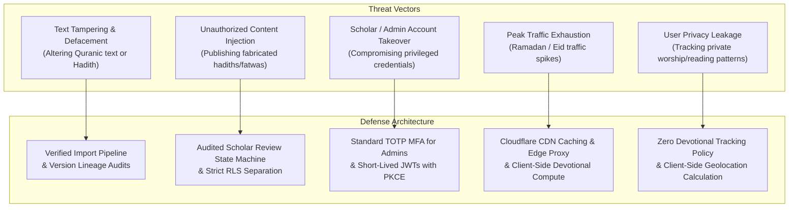

# Security Architecture & Threat Model
**Project:** Production-Grade Sunni Islamic Digital Platform  
**Status:** Phase 0 Baseline Specification (Revision 1)  
**Version:** 1.1.0  

---

## Phase 0 Architecture Review — Revision 1

This revision streamlines the security model to eliminate premature operational complexity while fortifying core scripture integrity and user data privacy:

1. **Pragmatic Security Phasing:**
   * **REQUIRED FOR MVP:**
     * Supabase Auth with PKCE and secure HTTP-only cookies for Web SSR.
     * PostgreSQL Row Level Security (RLS) enforcing strict user isolation on private data and public read-only access to published scripture.
     * Append-only `audit_logs` tracking all administrative and scholarly actions.
     * Standard TOTP Multi-Factor Authentication (MFA) for administrative and scholar accounts.
     * Cloudflare standard proxy/DNS protection against automated bot traffic and basic DoS.
     * Zero-tracking client-side geolocation processing for prayer times.
   * **USEFUL LATER (Phase 4–5):**
     * Cloudflare advanced WAF custom rules and rate-limiting endpoints before major Islamic holidays.
     * Automated security regression testing in CI/CD.
     * Mobile keystore encryption via `FlutterSecureStorage`.
   * **OPTIONAL / FUTURE (Post-Launch):**
     * FIDO2 / WebAuthn physical hardware key enforcement.
     * Complex automated offsite GPG-encrypted cold-storage replication.
     * Real-time anomalous audit log SIEM ingestion.

2. **Refined Scripture Integrity Strategy (Pipeline vs. Brittle Triggers):**
   * **The Issue with In-Flight Triggers:** Hardcoded database triggers that abort transactions on hash mismatches can inadvertently block legitimate data corrections, schema migrations, or orthographic normalization adjustments.
   * **The Revision 1 Solution:** Scripture integrity is enforced via a **three-tier verification architecture**:
     1. **Ingest Provenance:** Raw import files are hashed (SHA-256) upon arrival, creating an immutable provenance record in `quran_editions`.
     2. **Automated Structural Validation:** Pipeline verification scripts (@islamic/text-verifier) validate verse counts (6,236), Surah counts (114), and character stream continuity before any edition is marked `published`.
     3. **Audited Versioning & Lineage:** Canonical tables disallow direct, unversioned in-place mutations. Any corrigenda requires a new version record reviewed and signed off by a credentialed scholar, recorded in `audit_logs`.

---

## 1. Threat Modeling for an Islamic Platform



---

## 2. Scripture Integrity & Verification Pipeline

### 2.1 Explicit Hashing Strategy
To ensure unambiguous provenance and data-at-rest integrity:
1. **Raw Source Payload Hash:** Stored in `quran_editions.raw_source_sha256`. Computed over the raw upstream source file (XML/JSON/Text) upon initial ingest. Guarantees that upstream data is uncorrupted and verifiable against official publisher archives.
2. **Normalized Ayah Text Checksum:** Stored in `quran_ayahs.text_checksum`. Computed over the UTF-8 normalized character stream of `text_uthmani`. Used by CI/CD integrity scripts to detect data corruption at rest.
3. **Automated Pipeline Checks:**
   ```typescript
   // Executed by text-verifier in CI/CD before any deployment
   export function verifyScriptureIntegrity(ayahs: QuranAyah[]): boolean {
     if (ayahs.length !== 6236) throw new Error("Invalid verse count");
     for (const ayah of ayahs) {
       const computed = sha256(ayah.text_uthmani);
       if (computed !== ayah.text_checksum) {
         throw new Error(`Integrity violation at Ayah ${ayah.surah_id}:${ayah.ayah_number}`);
       }
     }
     return true;
   }
   ```

---

## 3. Authentication & Authorization

### 3.1 Authentication Architecture [REQUIRED FOR MVP]
* **Provider:** Supabase Auth (PKCE flow enabled).
* **Web Token Handling:** Secure, `HTTP-only`, `SameSite=Lax`, SSL-encrypted cookies managed via Next.js SSR middleware.
* **Mobile Token Handling (Phase 5):** Native secure storage via iOS Keychain and Android EncryptedSharedPreferences.
* **Multi-Factor Authentication (MFA):** Mandatory TOTP (Google Authenticator, 1Password) for all accounts with `scholar_reviewer`, `content_admin`, or `super_admin` roles.

### 3.2 Row Level Security (RLS) Policies [REQUIRED FOR MVP]
* Public scripture tables (`quran_ayahs`, `hadith_narrations`, `duas`) permit public `SELECT` for active/current versions.
* Application API clients have zero direct `UPDATE`, `INSERT`, or `DELETE` permissions on canonical scripture. Modifications occur through the versioned CMS pipeline.
* User-specific tables (`bookmarks`, `reading_history`, `user_notes`, `user_prayer_settings`) strictly enforce `auth.uid() = user_id`.

---

## 4. User Privacy & Ethical Data Governance

1. **Zero Tracking of Devotional Habits:** The platform will never sell, profile, or monetize user prayer consistency, reading habits, or search queries.
2. **Client-Side Geolocation:** User latitude and longitude used for prayer times and Qibla direction are processed entirely in memory on the client device. Coordinates are never transmitted to our servers or logged.
3. **Private Reflection Notes:** Reflection notes on verses and hadiths are strictly private by default (`is_private = TRUE`) and protected by database RLS.
4. **GDPR & Privacy Compliance:** Users can export all personal bookmarks and notes in JSON format or delete their account permanently at any time.

---

## 5. Audit Logging & Content Integrity Hardening [REQUIRED FOR MVP]

All administrative status changes, role assignments, and content publications record immutable entries in `audit_logs`:
* **Attributes:** `id` (UUID PK), `actor_id` (UUID REFERENCES `auth.users(id)`), `action` (`VARCHAR(100)`), `target_entity_type` (`VARCHAR(100)`), `target_entity_id` (`VARCHAR(100)`), `correlation_id` (UUID), `details` (`JSONB`), `source_context` (`VARCHAR(100)`), and `created_at` (`TIMESTAMPTZ`).
* **Database Engine Immutability:** Enforced via `BEFORE UPDATE OR DELETE` trigger (`public.prevent_audit_log_mutation()`) which strictly aborts any attempt to modify or delete audit log rows.
* **Actor Non-Repudiation Function:** `public.record_audit_event()` operates as `SECURITY DEFINER` with fixed `SET search_path = public, pg_temp;` and derives `actor_id` directly from `auth.uid()` to prevent audit record spoofing. Direct `EXECUTE` is revoked from `PUBLIC` and restricted to `authenticated`.
* **Automated Audit Triggers:** Triggers `trg_audit_content_version_lifecycle` and `trg_audit_content_entity_current_version` automatically record append-only audit entries upon version creation, review submission, approval, rejection, publication, archival, and active pointer reassignment.
* **Non-Recursive Role Verification:** Administrative audit inspection uses `public.has_any_role(lookup_uid, check_roles)` with safe `search_path = public, pg_temp;` to completely prevent infinite RLS policy recursion on `user_roles`.
* **Active Version Pointer Enforcement (F-01):** Trigger `trg_validate_content_entity_current_version` enforces that `content_entities.current_version_id` must strictly point to a `PUBLISHED` version belonging to the same entity. Archiving the active version is blocked until pointer reassignment.
* **Content Revision Immutability & Archival (F-02):** Trigger `trg_content_versions_immutability` guarantees that `ARCHIVED` versions cannot be modified or transitioned. A `PUBLISHED` version may only transition to `ARCHIVED`, during which all content, lineage, metadata, and attribution fields remain strictly frozen.
* **Lineage & DAG Cycle Prevention (F-03):** Trigger `trg_content_versions_parent_validate` enforces that `parent_version_id` must belong to the same entity, cannot be a self-reference, and must satisfy `parent.version_number < child.version_number` (strictly monotonic ordering preventing cycles).
* **Draft Identity Protection (F-04):** Authors may update draft content fields (`title`, `content_payload`, `source_provenance`, `change_summary`), but identity fields (`entity_id`, `version_number`, `parent_version_id`, `created_by`, `created_at`) and reviewer/publisher fields are immutable.
* **Approved Content Freezing (F-05):** Once a version is `APPROVED`, its content cannot be altered while retaining `APPROVED` status. Reviewer identity is bound to `auth.uid()`, and reviewers cannot directly publish.
* **Authoritative Cryptographic Hash Verification:** Trigger `trg_content_versions_hash_enforce` computes deterministic SHA-256 (`calculate_content_hash()`) over the canonical title and normalized JSONB payload. Untrusted client-supplied hashes are strictly validated: mismatched hashes are rejected with an exception, and NULL hashes are automatically populated with the authoritative hash.

---

## 6. Administrative System Security & Threat Mitigations

The platform's centralized administration layer enforces comprehensive defense-in-depth across API, database, and client surfaces:

### 6.1 Granular RBAC & Privilege Separation
* **Six Administrative Roles:** `super_admin`, `admin`, `content_admin`, `scholar_reviewer`, `support_admin`, `billing_admin`.
* **Database Verification Functions:** Authorization is evaluated via PostgreSQL `SECURITY DEFINER` functions `public.is_admin(lookup_uid)` and `public.has_permission(lookup_uid, required_perm)` configured with explicit `SET search_path = public, pg_temp;` to prevent search path injection attacks.
* **Separation of Concerns:** Support administrators can manage user state and suspension but have zero access to financial or scholarly approval pipelines. Billing administrators manage subscription tiers and waqf plans but have zero access to user passwords or content authoring.

### 6.2 Stealth Access & Non-Public UI Surfaces
* **Zero Public Admin Buttons:** No links, buttons, or visual indicators to administrative systems exist on public landing pages or standard user views.
* **Search Engine Exclusion:** Admin routes (`/admin`, `/[locale]/admin`) unconditionally emit `noindex, nofollow` metadata headers and are excluded from public sitemaps and disallow-listed in `robots.txt`.
* **Mobile Client Stealth:** The administrative menu item in Flutter is dynamically conditioned upon `user.role` existing in `kAdministrativeRoles`. Unauthenticated or unauthorized clients are shown standard user settings without any administrative indicators.

### 6.3 Credential Protection & Zero Hardcoded Secrets
* The platform codebase contains strictly zero default admin credentials, hardcoded passwords, or bypass tokens.
* All administrative actions are bound to authenticated operator identities via short-lived JWT tokens and logged to `public.audit_logs`.

### 6.4 Ethical Payment & Waqf Tokenization
* **Zero Raw Card Data:** The platform strictly prohibits storing Primary Account Numbers (PANs), Card Verification Values (CVVs), or expiration dates. All payment processing is offloaded to compliant payment gateways with tokenized customer and subscription identifiers.

